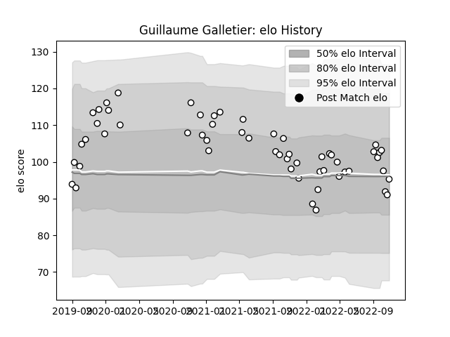

---  
layout: page  
title: Guillaume Galletier  
date: 2023-02-26 11:19:39.663447  
categories: player  
---
# Guillaume Galletier

## Positions: C

## Current elo: 95.0

## Current Percentile: 40.0

# Elo History

# Match History

| Team   |   Appearances |   Win Rate |
|:-------|--------------:|-----------:|
| Brive  |            56 |   0.348214 |

| Opponent             |   Matches |   Win Rate |
|:---------------------|----------:|-----------:|
| Toulon               |         7 |   0.428571 |
| Montpellier Herault  |         6 |   0.25     |
| Stade Francais Paris |         5 |   0.6      |
| Racing 92            |         5 |   0.2      |
| Lyon                 |         5 |   0        |
| Stade Toulousain     |         4 |   0.25     |
| Bordeaux Begles      |         3 |   0.666667 |
| Castres Olympique    |         3 |   0.333333 |
| Clermont Auvergne    |         3 |   0.666667 |
| Perpignan            |         3 |   0.666667 |
| Agen                 |         2 |   0        |
| Zebre                |         2 |   0        |
| La Rochelle          |         2 |   0.5      |
| Pau                  |         1 |   1        |
| Bayonne              |         1 |   1        |
| Edinburgh            |         1 |   0        |
| Bristol Rugby        |         1 |   0        |
| Biarritz Olympique   |         1 |   0        |
| Leicester Tigers     |         1 |   0        |