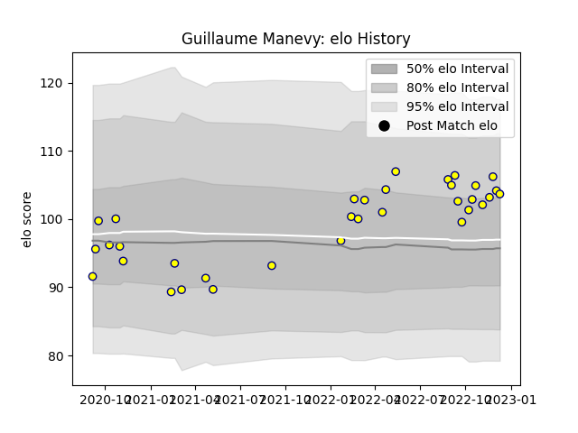

---  
layout: page  
title: Guillaume Manevy  
date: 2022-11-22 11:33:10.722234  
categories: player  
---
# Guillaume Manevy

## Positions: SH

## Current elo: 106.0

## Current Percentile: 78.0

# Elo History

# Match History

| Team   |   Appearances |   Win Rate |
|:-------|--------------:|-----------:|
| Nevers |            31 |   0.419355 |

| Opponent                   |   Matches |   Win Rate |
|:---------------------------|----------:|-----------:|
| Provence Rugby             |         4 |   0.5      |
| Vannes                     |         3 |   0.166667 |
| Montauban                  |         3 |   0.333333 |
| Rouen                      |         3 |   0.666667 |
| Valence Romans Drome Rugby |         2 |   0.5      |
| Oyonnax                    |         2 |   0        |
| Aurillac                   |         2 |   0        |
| Grenoble                   |         2 |   0        |
| Colomiers                  |         2 |   0        |
| Mont-de-Marsan             |         1 |   1        |
| Beziers                    |         1 |   1        |
| Massy                      |         1 |   1        |
| Perpignan                  |         1 |   0        |
| Soyaux-Angouleme           |         1 |   1        |
| US Bressane                |         1 |   1        |
| Biarritz Olympique         |         1 |   0.5      |
| Narbonne                   |         1 |   1        |