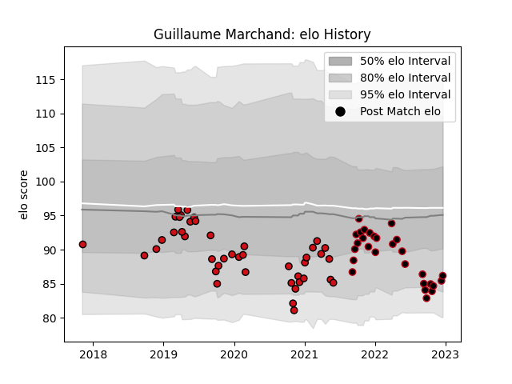

---  
layout: page  
title: Guillaume Marchand  
date: 2022-12-14 11:11:41.134857  
categories: player  
---
# Guillaume Marchand

## Positions: H

## Current elo: 85.0

## Current Percentile: 11.0

# Elo History

# Match History

| Team             |   Appearances |   Win Rate |
|:-----------------|--------------:|-----------:|
| Stade Toulousain |            43 |   0.674419 |
| Lyon             |            27 |   0.481481 |

| Opponent             |   Matches |   Win Rate |
|:---------------------|----------:|-----------:|
| Pau                  |         8 |   0.875    |
| Racing 92            |         7 |   0.571429 |
| Montpellier Herault  |         7 |   0.571429 |
| Bordeaux Begles      |         6 |   0.666667 |
| Brive                |         5 |   0.8      |
| Clermont Auvergne    |         5 |   0.9      |
| La Rochelle          |         5 |   0.4      |
| Toulon               |         4 |   0        |
| Stade Francais Paris |         4 |   0.75     |
| Castres Olympique    |         4 |   0.625    |
| Bayonne              |         3 |   0.333333 |
| Lyon                 |         3 |   0.333333 |
| Stade Toulousain     |         2 |   0.5      |
| Agen                 |         2 |   1        |
| Perpignan            |         2 |   0.5      |
| Bulls                |         1 |   0        |
| Biarritz Olympique   |         1 |   1        |
| Leinster             |         1 |   0        |