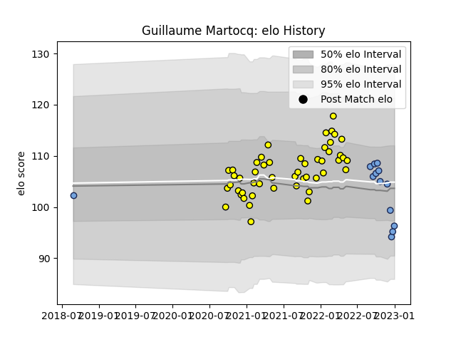

---  
layout: page  
title: Guillaume Martocq  
date: 2023-02-02 19:07:27.538131  
categories: player  
---
# Guillaume Martocq

## Positions: C

## Current elo: 69.0

## Current Percentile: 3.0

# Elo History

# Match History

| Team        |   Appearances |   Win Rate |
|:------------|--------------:|-----------:|
| Carcassonne |            50 |   0.54     |
| Bayonne     |            17 |   0.352941 |

| Opponent                   |   Matches |   Win Rate |
|:---------------------------|----------:|-----------:|
| Vannes                     |         4 |   0.5      |
| Nevers                     |         4 |   0.5      |
| Rouen                      |         4 |   1        |
| Provence Rugby             |         4 |   0.25     |
| Aurillac                   |         4 |   0.5      |
| Beziers                    |         3 |   0.666667 |
| Colomiers                  |         3 |   0.666667 |
| Grenoble                   |         3 |   0.333333 |
| Perpignan                  |         3 |   0.333333 |
| Mont-de-Marsan             |         3 |   0.166667 |
| Montauban                  |         3 |   0.666667 |
| US Bressane                |         2 |   1        |
| Toulon                     |         2 |   0.5      |
| Soyaux-Angouleme           |         2 |   1        |
| Scarlets                   |         2 |   0        |
| Oyonnax                    |         2 |   0        |
| Agen                       |         2 |   0.5      |
| Narbonne                   |         2 |   1        |
| Brive                      |         2 |   0.5      |
| Bordeaux Begles            |         2 |   0.5      |
| Biarritz Olympique         |         2 |   0.5      |
| Benetton Treviso           |         2 |   0        |
| Pau                        |         1 |   0.5      |
| La Rochelle                |         1 |   1        |
| Castres Olympique          |         1 |   0        |
| Stade Francais Paris       |         1 |   0        |
| Bayonne                    |         1 |   1        |
| Valence Romans Drome Rugby |         1 |   0        |
| Montpellier Herault        |         1 |   0        |