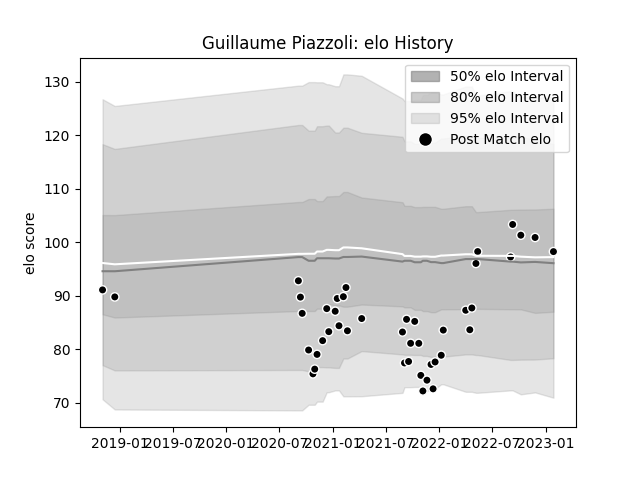

---  
layout: page  
title: Guillaume Piazzoli  
date: 2023-01-30 11:43:13.779439  
categories: player  
---
# Guillaume Piazzoli

## Positions: FL

## Current elo: 98.0

## Current Percentile: 64.0

# Elo History

# Match History

| Team           |   Appearances |   Win Rate |
|:---------------|--------------:|-----------:|
| Provence Rugby |            44 |   0.431818 |

| Opponent                   |   Matches |   Win Rate |
|:---------------------------|----------:|-----------:|
| Oyonnax                    |         4 |   0.375    |
| Beziers                    |         4 |   0.75     |
| Biarritz Olympique         |         4 |   0.125    |
| Grenoble                   |         4 |   0.75     |
| Rouen                      |         3 |   0.166667 |
| Colomiers                  |         3 |   0        |
| Mont-de-Marsan             |         3 |   0.333333 |
| Aurillac                   |         3 |   0.333333 |
| Nevers                     |         3 |   0.666667 |
| Agen                       |         2 |   0.5      |
| Soyaux-Angouleme           |         2 |   0.5      |
| Vannes                     |         2 |   0.5      |
| Carcassonne                |         2 |   1        |
| Perpignan                  |         1 |   0        |
| Bayonne                    |         1 |   0        |
| US Bressane                |         1 |   0.5      |
| Valence Romans Drome Rugby |         1 |   1        |
| Narbonne                   |         1 |   0        |