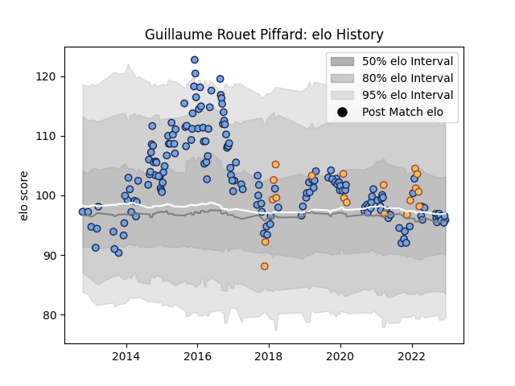

---  
layout: page  
title: Guillaume Rouet Piffard  
date: 2023-02-02 19:07:54.502255  
categories: player  
---
# Guillaume Rouet Piffard

## Positions: SH

## Country: Spain

## Current elo: 112.0

## Current Percentile: 84.0

# Elo History

# Match History

| Team    |   Appearances |   Win Rate |
|:--------|--------------:|-----------:|
| Bayonne |           232 |   0.506466 |
| Spain   |            19 |   0.684211 |

| Opponent             |   Matches |   Win Rate |
|:---------------------|----------:|-----------:|
| Toulon               |        12 |   0.416667 |
| La Rochelle          |        11 |   0.409091 |
| Stade Toulousain     |        10 |   0.5      |
| Stade Francais Paris |        10 |   0.4      |
| Brive                |        10 |   0.55     |
| Grenoble             |        10 |   0.35     |
| Lyon                 |         9 |   0.277778 |
| Clermont Auvergne    |         9 |   0.444444 |
| Montpellier Herault  |         9 |   0.222222 |
| Bordeaux Begles      |         9 |   0.222222 |
| Biarritz Olympique   |         8 |   0.625    |
| Castres Olympique    |         8 |   0.4375   |
| Montauban            |         7 |   0.714286 |
| Mont-de-Marsan       |         7 |   0.428571 |
| Colomiers            |         7 |   0.642857 |
| Agen                 |         7 |   0.785714 |
| Aurillac             |         7 |   0.714286 |
| Carcassonne          |         6 |   0.666667 |
| Beziers              |         6 |   0.666667 |
| Racing 92            |         6 |   0.333333 |
| Perpignan            |         6 |   0.5      |
| Vannes               |         5 |   0.8      |
| Provence Rugby       |         5 |   0.4      |
| Pau                  |         5 |   0.1      |
| Oyonnax              |         5 |   0.6      |
| Russia               |         4 |   1        |
| Nevers               |         4 |   0.625    |
| Dax                  |         4 |   0.625    |
| Massy                |         3 |   1        |
| US Bressane          |         3 |   1        |
| Narbonne             |         3 |   1        |
| Belgium              |         3 |   0.666667 |
| Romania              |         3 |   0.666667 |
| Portugal             |         2 |   0.5      |
| Arix Viadana         |         2 |   1        |
| Tarbes               |         2 |   0.5      |
| Soyaux-Angouleme     |         2 |   0.5      |
| Scarlets             |         2 |   0        |
| Georgia              |         2 |   0        |
| Connacht             |         2 |   0        |
| Netherlands          |         2 |   1        |
| Albi                 |         2 |   1        |
| Wasps                |         2 |   0.25     |
| Germany              |         1 |   1        |
| Mogliano             |         1 |   1        |
| Canada               |         1 |   0        |
| Rouen                |         1 |   1        |
| Exeter Chiefs        |         1 |   1        |
| Brazil               |         1 |   1        |
| London Irish         |         1 |   0        |
| Dragons              |         1 |   1        |
| Benetton Treviso     |         1 |   0        |
| Bourgoin-Jallieu     |         1 |   1        |