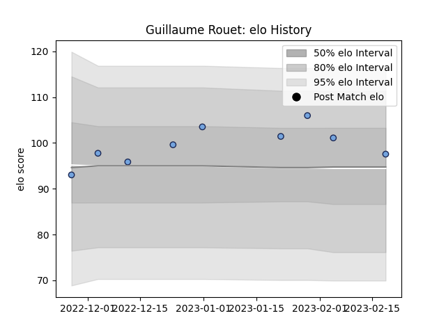

---  
layout: page  
title: Guillaume Rouet  
date: 2023-02-24 02:22:13.192072  
categories: player  
---
# Guillaume Rouet

## Positions: SH

## Current elo: 98.0

## Current Percentile: 70.0

# Elo History

# Match History

| Team    |   Appearances |   Win Rate |
|:--------|--------------:|-----------:|
| Bayonne |             9 |        0.5 |

| Opponent             |   Matches |   Win Rate |
|:---------------------|----------:|-----------:|
| Scarlets             |         2 |        0   |
| Brive                |         1 |        1   |
| Lyon                 |         1 |        1   |
| Montpellier Herault  |         1 |        0   |
| Pau                  |         1 |        0.5 |
| Stade Francais Paris |         1 |        1   |
| Stade Toulousain     |         1 |        0   |
| Toulon               |         1 |        1   |