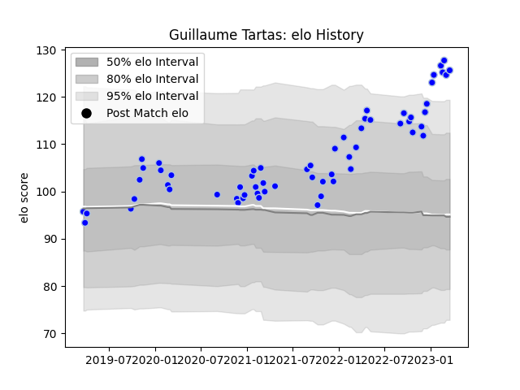

---  
layout: page  
title: Guillaume Tartas  
date: 2022-12-09 13:22:52.474889  
categories: player  
---
# Guillaume Tartas

## Positions: P

## Current elo: 110.0

## Current Percentile: 88.0

# Elo History

# Match History

| Team      |   Appearances |   Win Rate |
|:----------|--------------:|-----------:|
| Colomiers |            24 |        0.5 |

| Opponent                   |   Matches |   Win Rate |
|:---------------------------|----------:|-----------:|
| Grenoble                   |         4 |       0.75 |
| Nevers                     |         4 |       0.75 |
| Aurillac                   |         2 |       0    |
| Beziers                    |         2 |       0.5  |
| Biarritz Olympique         |         2 |       0    |
| Mont-de-Marsan             |         2 |       0    |
| Provence Rugby             |         2 |       1    |
| Rouen                      |         2 |       0.5  |
| Agen                       |         1 |       1    |
| Carcassonne                |         1 |       1    |
| Perpignan                  |         1 |       0    |
| Valence Romans Drome Rugby |         1 |       0    |