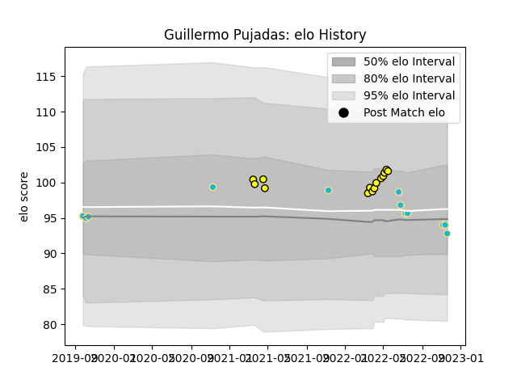

---  
layout: page  
title: Guillermo Pujadas  
date: 2022-11-22 11:41:51.888846  
categories: player  
---
# Guillermo Pujadas

## Positions: H

## Country: Uruguay

## Current elo: 93.0

## Current Percentile: 46.0

# Elo History

# Match History

| Team          |   Appearances |   Win Rate |
|:--------------|--------------:|-----------:|
| Penarol Rugby |            14 |   0.857143 |
| Uruguay       |            12 |   0.333333 |

| Opponent      |   Matches |   Win Rate |
|:--------------|----------:|-----------:|
| Cobras        |         4 |   1        |
| Romania       |         4 |   0.5      |
| Cafeteros Pro |         3 |   1        |
| Olimpia Lions |         3 |   0.666667 |
| Jaguares XV   |         2 |   1        |
| Japan         |         2 |   0        |
| Selknam       |         2 |   0.5      |
| Australia     |         1 |   0        |
| Fiji          |         1 |   1        |
| Georgia       |         1 |   0        |
| Spain         |         1 |   1        |
| Tonga         |         1 |   0        |
| Wales         |         1 |   0        |