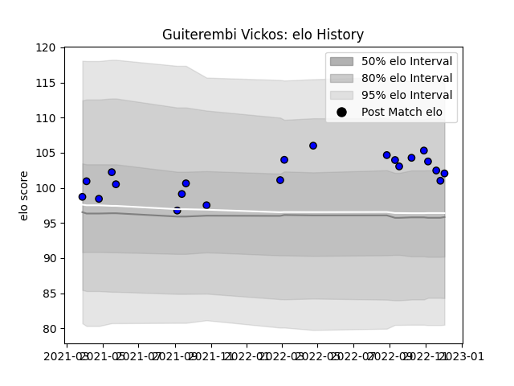

---  
layout: page  
title: Guiterembi Vickos  
date: 2023-01-15 11:48:41.617345  
categories: player  
---
# Guiterembi Vickos

## Positions: P

## Current elo: 95.0

## Current Percentile: 43.0

# Elo History

# Match History

| Team   |   Appearances |   Win Rate |
|:-------|--------------:|-----------:|
| Massy  |            34 |   0.588235 |

| Opponent                   |   Matches |   Win Rate |
|:---------------------------|----------:|-----------:|
| Dijon                      |         2 |        1   |
| Aubenas                    |         2 |        1   |
| US Bressane                |         2 |        0.5 |
| Blagnac                    |         2 |        0.5 |
| Bourgoin-Jallieu           |         2 |        0.5 |
| Suresnes                   |         2 |        1   |
| Cognac Saint Jean d'Angély |         2 |        1   |
| Soyaux-Angouleme           |         2 |        0.5 |
| Dax                        |         2 |        1   |
| Albi                       |         2 |        0.5 |
| Mont-de-Marsan             |         2 |        0.5 |
| Nevers                     |         1 |        0   |
| Tarbes                     |         1 |        1   |
| Rouen                      |         1 |        0   |
| Nice                       |         1 |        1   |
| Agen                       |         1 |        0   |
| Narbonne                   |         1 |        0   |
| Montauban                  |         1 |        0   |
| Colomiers                  |         1 |        0   |
| Carcassonne                |         1 |        1   |
| Biarritz Olympique         |         1 |        0   |
| Aurillac                   |         1 |        0   |
| Valence Romans Drome Rugby |         1 |        1   |