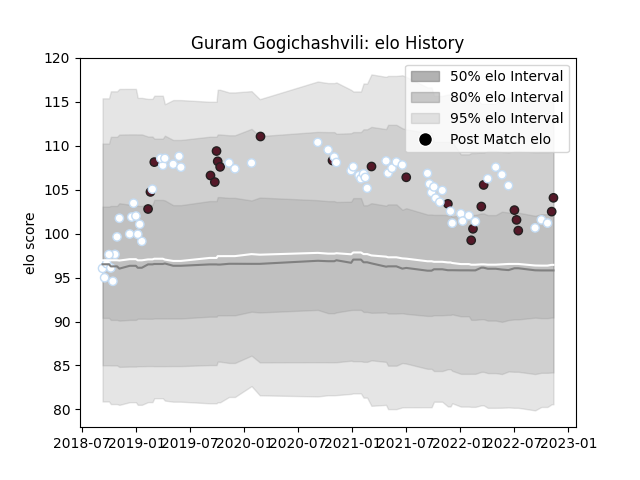

---  
layout: page  
title: Guram Gogichashvili  
date: 2022-11-16 11:34:38.863533  
categories: player  
---
# Guram Gogichashvili

## Positions: P

## Country: Georgia

## Current elo: 104.0

## Current Percentile: 75.0

# Elo History

# Match History

| Team      |   Appearances |   Win Rate |
|:----------|--------------:|-----------:|
| Racing 92 |            62 |   0.58871  |
| Georgia   |            22 |   0.590909 |

| Opponent             |   Matches |   Win Rate |
|:---------------------|----------:|-----------:|
| Bordeaux Begles      |         7 |   0.285714 |
| Stade Toulousain     |         6 |   0.333333 |
| Castres Olympique    |         6 |   0.5      |
| La Rochelle          |         5 |   0.4      |
| Stade Francais Paris |         5 |   0.6      |
| Montpellier Herault  |         5 |   0.6      |
| Lyon                 |         5 |   0.6      |
| Pau                  |         4 |   1        |
| Agen                 |         4 |   1        |
| Clermont Auvergne    |         4 |   0.625    |
| Portugal             |         3 |   0.833333 |
| Fiji                 |         2 |   0.25     |
| Leicester Tigers     |         2 |   1        |
| Belgium              |         2 |   1        |
| Ulster               |         2 |   0.5      |
| Uruguay              |         2 |   1        |
| Perpignan            |         2 |   1        |
| Romania              |         2 |   1        |
| Spain                |         2 |   1        |
| Scarlets             |         2 |   1        |
| Scotland             |         2 |   0        |
| South Africa         |         1 |   0        |
| Toulon               |         1 |   1        |
| Netherlands          |         1 |   1        |
| Samoa                |         1 |   0        |
| Argentina            |         1 |   0        |
| Italy                |         1 |   1        |
| Biarritz Olympique   |         1 |   0        |
| Bayonne              |         1 |   0        |
| Australia            |         1 |   0        |
| Wales                |         1 |   0        |