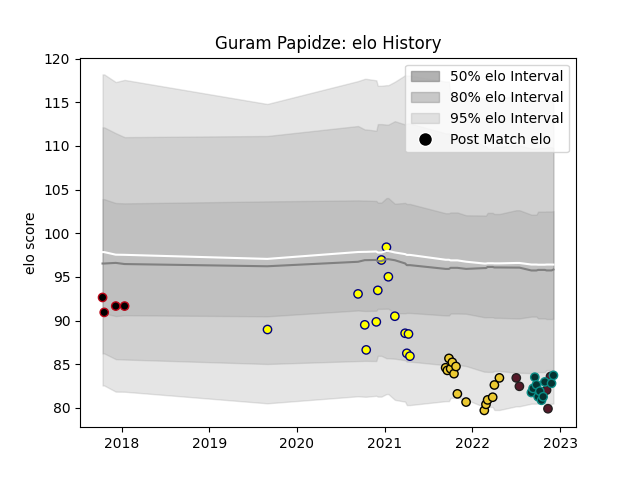

---  
layout: page  
title: Guram Papidze  
date: 2022-12-09 13:13:40.466464  
categories: player  
---
# Guram Papidze

## Positions: P

## Country: Georgia

## Current elo: 84.0

## Current Percentile: 7.0

# Elo History

# Match History

| Team        |   Appearances |   Win Rate |
|:------------|--------------:|-----------:|
| La Rochelle |            15 |   0.666667 |
| Nevers      |            14 |   0.5      |
| Pau         |            11 |   0.363636 |
| Georgia     |             5 |   0.6      |
| Lyon        |             4 |   0.25     |

| Opponent                   |   Matches |   Win Rate |
|:---------------------------|----------:|-----------:|
| Perpignan                  |         4 |   0.5      |
| Racing 92                  |         3 |   0.333333 |
| Biarritz Olympique         |         3 |   0.666667 |
| Brive                      |         3 |   1        |
| Clermont Auvergne          |         3 |   0.333333 |
| Stade Francais Paris       |         2 |   0        |
| Aurillac                   |         2 |   0.5      |
| Montpellier Herault        |         2 |   0        |
| Sale Sharks                |         2 |   0.5      |
| Oyonnax                    |         2 |   0        |
| Castres Olympique          |         2 |   0.5      |
| Toulon                     |         2 |   0.5      |
| Stade Toulousain           |         2 |   0.5      |
| Provence Rugby             |         1 |   1        |
| Samoa                      |         1 |   0        |
| Rouen                      |         1 |   1        |
| Uruguay                    |         1 |   1        |
| Valence Romans Drome Rugby |         1 |   1        |
| Argentina                  |         1 |   0        |
| Portugal                   |         1 |   1        |
| Pau                        |         1 |   1        |
| Montauban                  |         1 |   1        |
| Lyon                       |         1 |   0        |
| La Rochelle                |         1 |   1        |
| Grenoble                   |         1 |   0        |
| Colomiers                  |         1 |   0        |
| Cardiff Blues              |         1 |   0        |
| Bordeaux Begles            |         1 |   1        |
| Beziers                    |         1 |   1        |
| Wales                      |         1 |   1        |