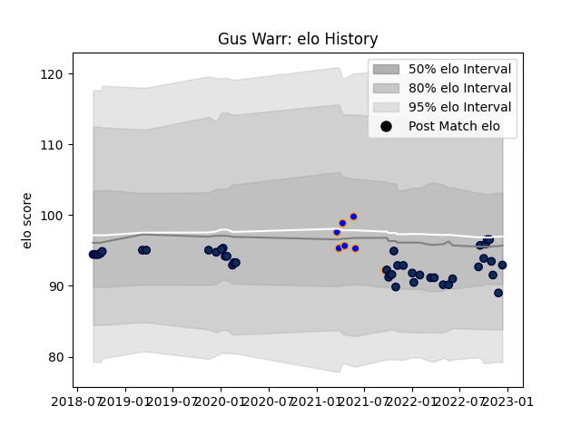

---  
layout: page  
title: Gus Warr  
date: 2023-01-06 00:10:19.601895  
categories: player  
---
# Gus Warr

## Positions: SH

## Current elo: 104.0

## Current Percentile: 54.0

# Elo History

# Match History

| Team        |   Appearances |   Win Rate |
|:------------|--------------:|-----------:|
| Sale Sharks |            46 |   0.543478 |
| Doncaster   |             9 |   0.666667 |

| Opponent            |   Matches |   Win Rate |
|:--------------------|----------:|-----------:|
| Leicester Tigers    |         7 |   0.714286 |
| Exeter Chiefs       |         5 |   0.4      |
| Saracens            |         4 |   0        |
| Newcastle Falcons   |         4 |   0.5      |
| Gloucester Rugby    |         4 |   0.75     |
| Harlequins          |         4 |   0.5      |
| Bristol Rugby       |         3 |   0.666667 |
| Wasps               |         3 |   0.666667 |
| Bath Rugby          |         2 |   0.75     |
| Northampton Saints  |         2 |   1        |
| London Irish        |         2 |   0.75     |
| Worcester Warriors  |         2 |   0.5      |
| Glasgow Warriors    |         2 |   0        |
| Bedford             |         1 |   1        |
| Jersey              |         1 |   1        |
| Hartpury College    |         1 |   1        |
| Ealing Trailfinders |         1 |   0        |
| Nottingham          |         1 |   1        |
| Richmond            |         1 |   1        |
| Coventry            |         1 |   0        |
| Stade Toulousain    |         1 |   0        |
| Ulster              |         1 |   1        |
| Cornish Pirates     |         1 |   1        |
| La Rochelle         |         1 |   0        |