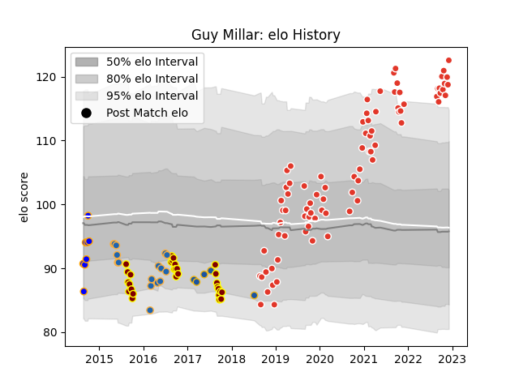

---  
layout: page  
title: Guy Millar  
date: 2023-03-21 18:28:05.665025  
categories: player  
---
# Guy Millar

Last updated: 2023-03-21
## Positions: P

## Current elo: 118.0

## Current Percentile: 87.0

# Elo History

# Match History

| Team                |   Appearances |   Win Rate |
|:--------------------|--------------:|-----------:|
| Biarritz Olympique  |           105 |   0.580952 |
| Southland           |            30 |   0.15     |
| Western Force       |            16 |   0.25     |
| Greater Sydney Rams |             8 |   0.4375   |
| Highlanders         |             5 |   0.4      |

| Opponent                   |   Matches |   Win Rate |
|:---------------------------|----------:|-----------:|
| Carcassonne                |         7 |   0.571429 |
| Nevers                     |         7 |   0.357143 |
| Vannes                     |         7 |   0.571429 |
| Mont-de-Marsan             |         6 |   0.416667 |
| Montauban                  |         6 |   0.666667 |
| Perpignan                  |         6 |   0.166667 |
| Soyaux-Angouleme           |         6 |   0.666667 |
| Provence Rugby             |         6 |   0.75     |
| Oyonnax                    |         6 |   0.833333 |
| Aurillac                   |         6 |   0.833333 |
| Colomiers                  |         6 |   0.5      |
| Beziers                    |         5 |   0.6      |
| Grenoble                   |         5 |   0.9      |
| Queensland Reds            |         3 |   0.666667 |
| Hawke's Bay                |         3 |   0        |
| Manawatu                   |         3 |   0.333333 |
| Massy                      |         3 |   0.666667 |
| North Harbour              |         3 |   0        |
| Rouen                      |         3 |   0.666667 |
| Otago                      |         3 |   0        |
| Auckland                   |         3 |   0.166667 |
| Brumbies                   |         3 |   0        |
| Brive                      |         3 |   0.5      |
| Wellington                 |         3 |   0        |
| Northland                  |         3 |   0.666667 |
| Bayonne                    |         3 |   0.833333 |
| Bay of Plenty              |         3 |   0.333333 |
| Melbourne Rebels           |         3 |   0.333333 |
| Tasman                     |         2 |   0        |
| US Bressane                |         2 |   0.5      |
| Canterbury                 |         2 |   0        |
| Valence Romans Drome Rugby |         2 |   0.5      |
| Blues                      |         2 |   0        |
| Roval Drome XV             |         1 |   1        |
| Agen                       |         1 |   0        |
| Sydney Stars               |         1 |   1        |
| Stade Francais Paris       |         1 |   1        |
| Stade Toulousain           |         1 |   0        |
| Stormers                   |         1 |   0        |
| Sunwolves                  |         1 |   1        |
| Taranaki                   |         1 |   0        |
| Toulon                     |         1 |   0        |
| Waikato                    |         1 |   0        |
| Racing 92                  |         1 |   1        |
| NSW Country Eagles         |         1 |   0        |
| Queensland Country         |         1 |   0        |
| Perth Spirit               |         1 |   1        |
| Bordeaux Begles            |         1 |   1        |
| Brisbane City              |         1 |   1        |
| Bulls                      |         1 |   0        |
| Canberra Vikings           |         1 |   0        |
| Castres Olympique          |         1 |   0        |
| Cheetahs                   |         1 |   0        |
| Chiefs                     |         1 |   0        |
| Crusaders                  |         1 |   0        |
| Highlanders                |         1 |   0        |
| Hurricanes                 |         1 |   0        |
| Lyon                       |         1 |   0        |
| Melbourne Rising           |         1 |   0        |
| New South Wales Waratahs   |         1 |   1        |
| North Harbour Rays         |         1 |   0.5      |
| Pau                        |         1 |   0        |
| Western Force              |         1 |   1        |