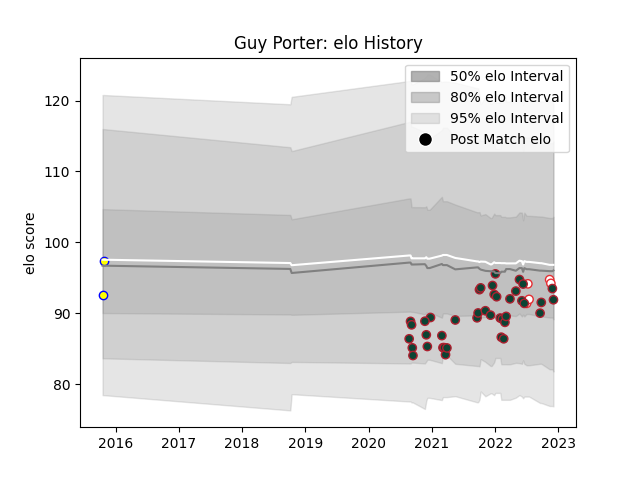

---  
layout: page  
title: Guy Porter  
date: 2022-12-18 16:15:00.029236  
categories: player  
---
# Guy Porter

## Positions: C, W

## Country: England

## Current elo: 95.0

## Current Percentile: 42.0

# Elo History

# Match History

| Team             |   Appearances |   Win Rate |
|:-----------------|--------------:|-----------:|
| Leicester Tigers |            43 |   0.732558 |
| England          |             5 |   0.7      |
| Sydney Rays      |             2 |   0        |
| Sydney Stars     |             2 |   0        |

| Opponent           |   Matches |   Win Rate |
|:-------------------|----------:|-----------:|
| Gloucester Rugby   |         5 |   0.8      |
| London Irish       |         4 |   0.75     |
| Northampton Saints |         4 |   1        |
| Bristol Rugby      |         4 |   0.625    |
| Newcastle Falcons  |         4 |   1        |
| Exeter Chiefs      |         4 |   0.5      |
| Bath Rugby         |         3 |   0.666667 |
| Wasps              |         3 |   0.333333 |
| Saracens           |         3 |   0.666667 |
| Australia          |         3 |   0.666667 |
| Harlequins         |         2 |   1        |
| Melbourne Rising   |         2 |   0        |
| Sale Sharks        |         2 |   0        |
| Japan              |         1 |   1        |
| New Zealand        |         1 |   0.5      |
| Clermont Auvergne  |         1 |   1        |
| Brisbane City      |         1 |   0        |
| Ospreys            |         1 |   1        |
| Queensland Country |         1 |   0        |
| Bordeaux Begles    |         1 |   1        |
| Bayonne            |         1 |   1        |
| Worcester Warriors |         1 |   1        |