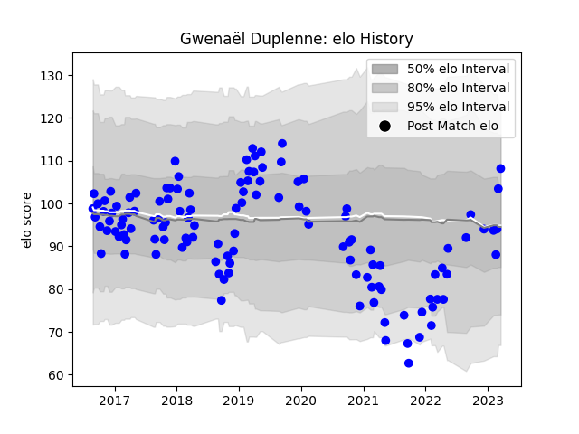

---  
layout: page  
title: Gwenaël Duplenne  
date: 2022-12-14 11:23:56.680888  
categories: player  
---
# Gwenaël Duplenne

## Positions: W

## Current elo: 98.0

## Current Percentile: 69.0

# Elo History

# Match History

| Team   |   Appearances |   Win Rate |
|:-------|--------------:|-----------:|
| Vannes |           110 |   0.563636 |

| Opponent                   |   Matches |   Win Rate |
|:---------------------------|----------:|-----------:|
| Aurillac                   |        10 |   0.6      |
| Mont-de-Marsan             |         9 |   0.666667 |
| Beziers                    |         9 |   0.666667 |
| Colomiers                  |         7 |   0.857143 |
| Soyaux-Angouleme           |         7 |   0.571429 |
| Carcassonne                |         7 |   0.357143 |
| Nevers                     |         6 |   0.583333 |
| Oyonnax                    |         5 |   0.4      |
| Biarritz Olympique         |         5 |   0.6      |
| Narbonne                   |         4 |   0.75     |
| Montauban                  |         4 |   0.5      |
| Perpignan                  |         4 |   0.25     |
| Grenoble                   |         4 |   0.25     |
| Dax                        |         4 |   0.25     |
| Provence Rugby             |         4 |   0.5      |
| Rouen                      |         3 |   0.666667 |
| US Bressane                |         3 |   0.833333 |
| Bayonne                    |         3 |   0.666667 |
| Massy                      |         3 |   0.666667 |
| Agen                       |         2 |   0.25     |
| Albi                       |         2 |   1        |
| Brive                      |         2 |   0        |
| Valence Romans Drome Rugby |         2 |   0.5      |
| Bourgoin-Jallieu           |         1 |   1        |