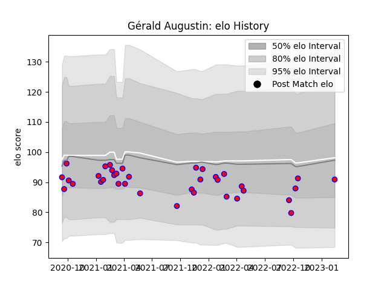

---  
layout: page  
title: Gérald Augustin  
date: 2023-02-15 22:14:03.209650  
categories: player  
---
# Gérald Augustin

## Positions: FB, FH

## Current elo: 91.0

## Current Percentile: 38.0

# Elo History

# Match History

| Team    |   Appearances |   Win Rate |
|:--------|--------------:|-----------:|
| Blagnac |            36 |   0.472222 |

| Opponent                   |   Matches |   Win Rate |
|:---------------------------|----------:|-----------:|
| Cognac Saint Jean d'Angély |         5 |   0.6      |
| Chambery                   |         4 |   1        |
| Tarbes                     |         4 |   0.75     |
| Aubenas                    |         3 |   0.666667 |
| Bourgoin-Jallieu           |         3 |   0.333333 |
| Dax                        |         3 |   0.333333 |
| Suresnes                   |         3 |   0.333333 |
| US Bressane                |         3 |   0        |
| Albi                       |         2 |   0.5      |
| Narbonne                   |         2 |   0        |
| Soyaux-Angouleme           |         2 |   0        |
| Dijon                      |         1 |   0        |
| Massy                      |         1 |   1        |