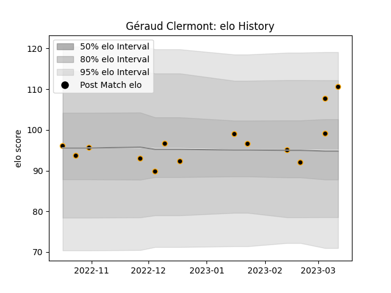

---  
layout: page  
title: Géraud Clermont  
date: 2023-01-17 11:35:30.514273  
categories: player  
---
# Géraud Clermont

## Positions: P

## Current elo: 99.0

## Current Percentile: 38.0

# Elo History

# Match History

| Team     |   Appearances |   Win Rate |
|:---------|--------------:|-----------:|
| Chambery |             8 |        0.5 |

| Opponent                   |   Matches |   Win Rate |
|:---------------------------|----------:|-----------:|
| Albi                       |         1 |          0 |
| Carqueiranne-Hyères        |         1 |          0 |
| Narbonne                   |         1 |          1 |
| Rennes                     |         1 |          1 |
| Suresnes                   |         1 |          0 |
| Tarbes                     |         1 |          0 |
| US Bressane                |         1 |          1 |
| Valence Romans Drome Rugby |         1 |          1 |