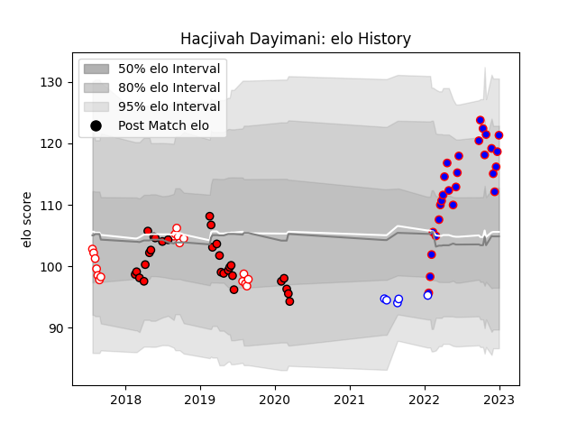

---  
layout: page  
title: Hacjivah Dayimani  
date: 2023-03-21 18:45:37.281646  
categories: player  
---
# Hacjivah Dayimani

Last updated: 2023-03-21
## Positions: N8, FL

## Current elo: 123.0

## Current Percentile: 89.0

# Elo History

# Match History

| Team             |   Appearances |   Win Rate |
|:-----------------|--------------:|-----------:|
| Lions            |            29 |   0.37931  |
| Stormers         |            28 |   0.839286 |
| Golden Lions     |            20 |   0.5      |
| Western Province |             6 |   0.666667 |

| Opponent                 |   Matches |   Win Rate |
|:-------------------------|----------:|-----------:|
| Sharks                   |         8 |   0.5      |
| Bulls                    |         6 |   0.666667 |
| Blue Bulls               |         5 |   0.4      |
| Stormers                 |         5 |   0.6      |
| Natal Sharks             |         5 |   0.4      |
| Griquas                  |         5 |   0.8      |
| Free State Cheetahs      |         4 |   0.5      |
| Western Province         |         3 |   0.333333 |
| Pumas                    |         3 |   0.666667 |
| New South Wales Waratahs |         3 |   0.666667 |
| Jaguares                 |         3 |   0.666667 |
| Crusaders                |         2 |   0        |
| Edinburgh                |         2 |   1        |
| Brumbies                 |         2 |   0.5      |
| Hurricanes               |         2 |   0        |
| Blues                    |         2 |   0        |
| Ulster                   |         2 |   1        |
| Lions                    |         2 |   1        |
| Cardiff Blues            |         2 |   0.5      |
| Scarlets                 |         2 |   1        |
| Ospreys                  |         2 |   0.75     |
| Connacht                 |         2 |   0.5      |
| Queensland Reds          |         1 |   0        |
| Sunwolves                |         1 |   1        |
| Clermont Auvergne        |         1 |   0        |
| Glasgow Warriors         |         1 |   1        |
| Golden Lions             |         1 |   1        |
| Dragons                  |         1 |   1        |
| Melbourne Rebels         |         1 |   0        |
| London Irish             |         1 |   1        |
| Leinster                 |         1 |   1        |
| Highlanders              |         1 |   1        |
| Zebre                    |         1 |   1        |