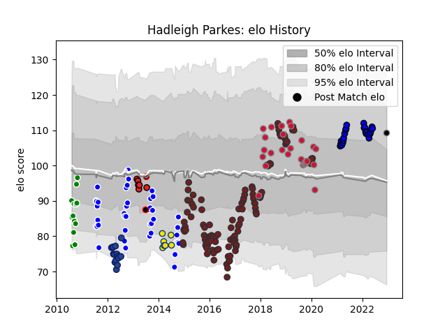

---  
layout: page  
title: Hadleigh Parkes  
date: 2023-03-21 18:13:39.173689  
categories: player  
---
# Hadleigh Parkes

Last updated: 2023-03-21
## Positions: C

## Country: Wales

## Current elo: 109.0

## Current Percentile: 80.0

# Elo History

# Match History

| Team                   |   Appearances |   Win Rate |
|:-----------------------|--------------:|-----------:|
| Scarlets               |           116 |   0.612069 |
| Auckland               |            41 |   0.609756 |
| Wales                  |            29 |   0.689655 |
| Saitama Wild Knights   |            24 |   0.979167 |
| Blues                  |            15 |   0.266667 |
| Manawatu               |            13 |   0.230769 |
| Hurricanes             |             7 |   0.428571 |
| Southern Kings         |             6 |   0.166667 |
| Eastern Province Kings |             2 |   0.5      |
| Black Rams Tokyo       |             1 |   0        |

| Opponent                          |   Matches |   Win Rate |
|:----------------------------------|----------:|-----------:|
| Ospreys                           |        11 |   0.636364 |
| Dragons                           |        10 |   0.8      |
| Cardiff Blues                     |        10 |   0.6      |
| Ulster                            |         9 |   0.444444 |
| Leinster                          |         9 |   0.555556 |
| Benetton Treviso                  |         9 |   1        |
| Glasgow Warriors                  |         8 |   0.625    |
| Canterbury                        |         7 |   0.142857 |
| Edinburgh                         |         7 |   0.428571 |
| Zebre                             |         7 |   1        |
| Munster                           |         6 |   0.583333 |
| Taranaki                          |         6 |   0.333333 |
| Connacht                          |         6 |   0.666667 |
| Toulon                            |         6 |   0.333333 |
| Counties Manukau                  |         5 |   0.6      |
| North Harbour                     |         5 |   0.8      |
| England                           |         5 |   0.4      |
| Wellington                        |         5 |   0.8      |
| Waikato                           |         5 |   0.4      |
| Sharks                            |         4 |   0        |
| Ireland                           |         4 |   0.25     |
| Otago                             |         4 |   0.5      |
| South Africa                      |         4 |   0.75     |
| Racing 92                         |         4 |   0        |
| Bay of Plenty                     |         4 |   0.5      |
| France                            |         4 |   0.75     |
| Yokohama Canon Eagles             |         4 |   1        |
| Crusaders                         |         4 |   0.25     |
| Northland                         |         3 |   0.666667 |
| Scotland                          |         3 |   1        |
| Manawatu                          |         3 |   1        |
| Chiefs                            |         3 |   0        |
| Leicester Tigers                  |         3 |   0.333333 |
| Tokyo Sungoliath                  |         3 |   1        |
| Hurricanes                        |         3 |   0        |
| Highlanders                       |         3 |   0        |
| Southland                         |         2 |   0.5      |
| Saracens                          |         2 |   0.25     |
| Stormers                          |         2 |   0        |
| Australia                         |         2 |   1        |
| Sale Sharks                       |         2 |   0.5      |
| Bulls                             |         2 |   1        |
| Tasman                            |         2 |   0.5      |
| Bath Rugby                        |         2 |   0.5      |
| Toyota Verblitz                   |         2 |   1        |
| Cheetahs                          |         2 |   1        |
| Kobelco Kobe Steelers             |         2 |   0.75     |
| Italy                             |         2 |   1        |
| Shizuoka Blue Revs                |         2 |   1        |
| Hawke's Bay                       |         2 |   0.5      |
| Urayasu D-Rocks                   |         2 |   1        |
| Green Rockets Tokatsu             |         2 |   1        |
| Western Force                     |         2 |   1        |
| Kubota Spears Funabashi Tokyo-Bay |         2 |   1        |
| Toshiba Brave Lupus Tokyo         |         1 |   1        |
| Southern Kings                    |         1 |   1        |
| Uruguay                           |         1 |   1        |
| Argentina                         |         1 |   1        |
| Queensland Reds                   |         1 |   0        |
| Pumas                             |         1 |   0        |
| Black Rams Tokyo                  |         1 |   1        |
| Brumbies                          |         1 |   1        |
| Fiji                              |         1 |   1        |
| Georgia                           |         1 |   1        |
| Griffons                          |         1 |   1        |
| Hanazono Kintetsu Liners          |         1 |   1        |
| Hino Red Dolphins                 |         1 |   1        |
| La Rochelle                       |         1 |   1        |
| Lions                             |         1 |   1        |
| Auckland                          |         1 |   0        |
| Melbourne Rebels                  |         1 |   0        |
| Mitsubishi Dynaboars              |         1 |   0        |
| NTT Docomo Red Hurricanes Osaka   |         1 |   1        |
| New Zealand                       |         1 |   0        |
| Northampton Saints                |         1 |   0        |
| London Irish                      |         1 |   1        |