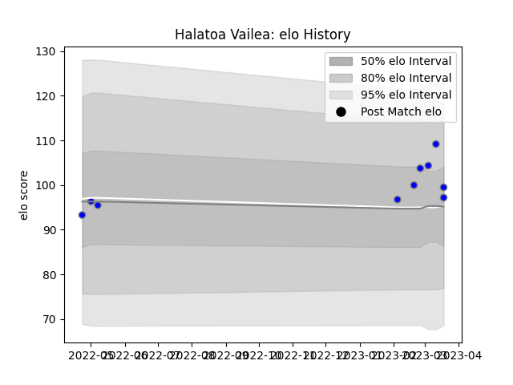

---  
layout: page  
title: Halatoa Vailea  
date: 2023-03-17 17:08:21.975377  
categories: player  
---
# Halatoa Vailea

## Positions: C, W

## Current elo: 108.0

## Current Percentile: 73.0

# Elo History

# Match History

| Team                              |   Appearances |   Win Rate |
|:----------------------------------|--------------:|-----------:|
| Kubota Spears Funabashi Tokyo-Bay |             8 |       0.75 |

| Opponent                  |   Matches |   Win Rate |
|:--------------------------|----------:|-----------:|
| Saitama Wild Knights      |         2 |          0 |
| Kobelco Kobe Steelers     |         1 |          1 |
| Mitsubishi Dynaboars      |         1 |          1 |
| Shizuoka Blue Revs        |         1 |          1 |
| Toshiba Brave Lupus Tokyo |         1 |          1 |
| Toyota Verblitz           |         1 |          1 |
| Urayasu D-Rocks           |         1 |          1 |