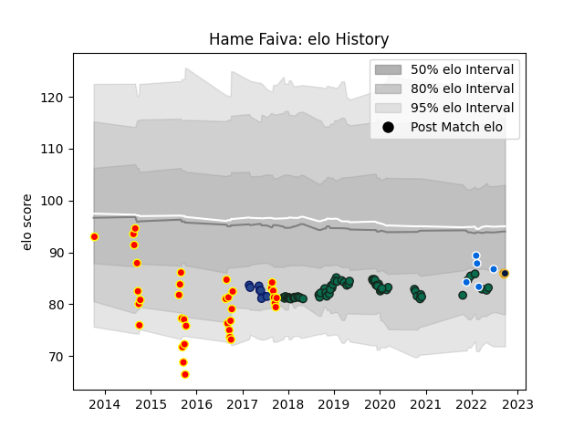

---  
layout: page  
title: Hame Faiva  
date: 2023-03-30 11:33:03.668294  
categories: player  
---
# Hame Faiva

Last updated: 2023-03-30
## Positions: H

## Country: Italy

## Current elo: 86.0

## Current Percentile: 23.0

# Elo History

# Match History

| Team               |   Appearances |   Win Rate |
|:-------------------|--------------:|-----------:|
| Benetton Treviso   |            62 |   0.403226 |
| Waikato            |            36 |   0.402778 |
| Blues              |             8 |   0.5625   |
| Italy              |             5 |   0.4      |
| Worcester Warriors |             3 |   0.333333 |

| Opponent                |   Matches |   Win Rate |
|:------------------------|----------:|-----------:|
| Zebre                   |         9 |   0.888889 |
| Scarlets                |         6 |   0.166667 |
| Dragons                 |         6 |   0.75     |
| Cardiff Blues           |         5 |   0.2      |
| Leinster                |         5 |   0        |
| Manawatu                |         4 |   0.5      |
| Counties Manukau        |         4 |   0.5      |
| Canterbury              |         4 |   0        |
| Tasman                  |         4 |   0        |
| Ulster                  |         4 |   0.125    |
| Wellington              |         4 |   0.5      |
| Cheetahs                |         3 |   0.666667 |
| Taranaki                |         3 |   0.166667 |
| Edinburgh               |         3 |   0.666667 |
| Munster                 |         3 |   0        |
| Auckland                |         3 |   0.333333 |
| Southern Kings          |         2 |   1        |
| Northland               |         2 |   0        |
| Northampton Saints      |         2 |   0        |
| North Harbour           |         2 |   1        |
| Lyon                    |         2 |   0.5      |
| Connacht                |         2 |   0        |
| Hawke's Bay             |         2 |   1        |
| Harlequins              |         2 |   0.5      |
| Grenoble                |         2 |   1        |
| Bay of Plenty           |         2 |   1        |
| Glasgow Warriors        |         2 |   0.5      |
| Chiefs                  |         2 |   0.25     |
| Ireland                 |         1 |   0        |
| Bath Rugby              |         1 |   0        |
| Uruguay                 |         1 |   1        |
| Toulon                  |         1 |   0        |
| British and Irish Lions |         1 |   1        |
| Sunwolves               |         1 |   0        |
| Stormers                |         1 |   0        |
| Southland               |         1 |   1        |
| Portugal                |         1 |   1        |
| England                 |         1 |   0        |
| Queensland Reds         |         1 |   1        |
| Lions                   |         1 |   0        |
| Otago                   |         1 |   0        |
| Ospreys                 |         1 |   0        |
| Exeter Chiefs           |         1 |   0        |
| France                  |         1 |   0        |
| Newcastle Falcons       |         1 |   1        |
| Melbourne Rebels        |         1 |   1        |
| London Irish            |         1 |   0        |
| Agen                    |         1 |   0        |