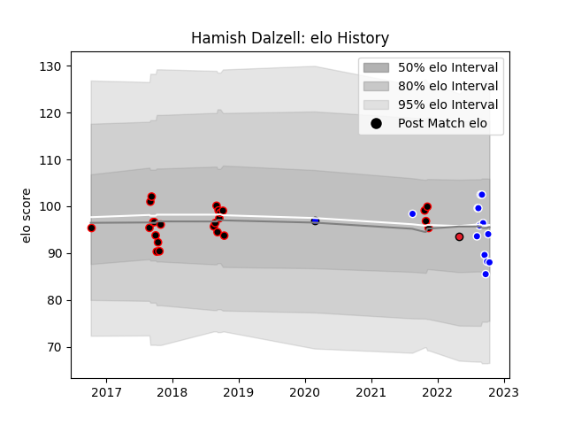

---  
layout: page  
title: Hamish Dalzell  
date: 2023-03-02 11:27:18.474296  
categories: player  
---
# Hamish Dalzell

## Positions: L

## Current elo: 88.0

## Current Percentile: 46.0

# Elo History

# Match History

| Team                 |   Appearances |   Win Rate |
|:---------------------|--------------:|-----------:|
| Canterbury           |            24 |   0.75     |
| Auckland             |            13 |   0.538462 |
| Crusaders            |             1 |   0        |
| Saitama Wild Knights |             1 |   1        |

| Opponent                        |   Matches |   Win Rate |
|:--------------------------------|----------:|-----------:|
| North Harbour                   |         6 |   1        |
| Tasman                          |         5 |   0.6      |
| Otago                           |         4 |   0.75     |
| Bay of Plenty                   |         3 |   0.666667 |
| Taranaki                        |         3 |   0.666667 |
| Waikato                         |         3 |   0.333333 |
| Wellington                      |         3 |   0.333333 |
| Auckland                        |         2 |   0.5      |
| Manawatu                        |         2 |   1        |
| Southland                       |         2 |   1        |
| Canterbury                      |         1 |   0        |
| Counties Manukau                |         1 |   1        |
| Hawke's Bay                     |         1 |   1        |
| NTT Docomo Red Hurricanes Osaka |         1 |   1        |
| New South Wales Waratahs        |         1 |   0        |
| Northland                       |         1 |   0        |