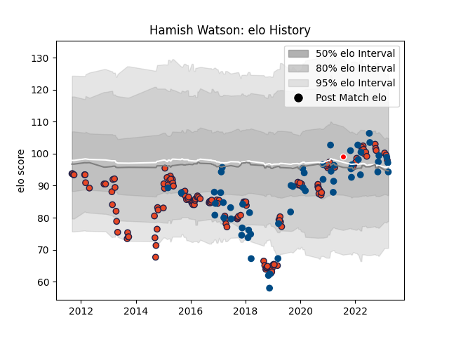

---  
layout: page  
title: Hamish Watson  
date: 2023-01-30 11:42:46.824552  
categories: player  
---
# Hamish Watson

## Positions: FL

## Country: Scotland

## Current elo: 102.0

## Current Percentile: 66.0

# Elo History

# Match History

| Team                    |   Appearances |   Win Rate |
|:------------------------|--------------:|-----------:|
| Edinburgh               |           136 |   0.488971 |
| Scotland                |            52 |   0.567308 |
| British and Irish Lions |             1 |   1        |

| Opponent             |   Matches |   Win Rate |
|:---------------------|----------:|-----------:|
| Glasgow Warriors     |        15 |   0.6      |
| Benetton Treviso     |        10 |   0.6      |
| Ospreys              |         9 |   0.222222 |
| Scarlets             |         9 |   0.5      |
| Ulster               |         9 |   0.222222 |
| Dragons              |         9 |   0.777778 |
| Munster              |         9 |   0.333333 |
| Connacht             |         8 |   0.25     |
| Italy                |         7 |   0.857143 |
| Wales                |         7 |   0.285714 |
| Cardiff Blues        |         7 |   0.142857 |
| Leinster             |         6 |   0.333333 |
| England              |         6 |   0.583333 |
| Ireland              |         6 |   0.166667 |
| Zebre                |         5 |   0.8      |
| France               |         5 |   0.8      |
| Australia            |         5 |   0.6      |
| Bordeaux Begles      |         4 |   0.5      |
| Argentina            |         4 |   0.75     |
| Georgia              |         3 |   1        |
| Stade Francais Paris |         3 |   0.666667 |
| South Africa         |         3 |   0.333333 |
| London Irish         |         3 |   0.666667 |
| Stormers             |         2 |   0        |
| Toulon               |         2 |   1        |
| Wasps                |         2 |   1        |
| Sharks               |         2 |   0.5      |
| Newcastle Falcons    |         2 |   1        |
| New Zealand          |         2 |   0        |
| Agen                 |         2 |   1        |
| Montpellier Herault  |         2 |   0.5      |
| Lions                |         2 |   0        |
| Fiji                 |         2 |   0.5      |
| Harlequins           |         2 |   1        |
| Lyon                 |         2 |   0.5      |
| Grenoble             |         2 |   0.5      |
| Tonga                |         1 |   1        |
| Brive                |         1 |   1        |
| Bulls                |         1 |   0        |
| Cheetahs             |         1 |   1        |
| Southern Kings       |         1 |   1        |
| Gloucester Rugby     |         1 |   0        |
| Japan                |         1 |   1        |
| Aironi               |         1 |   0        |
| Saracens             |         1 |   1        |
| Samoa                |         1 |   1        |
| La Rochelle          |         1 |   0        |