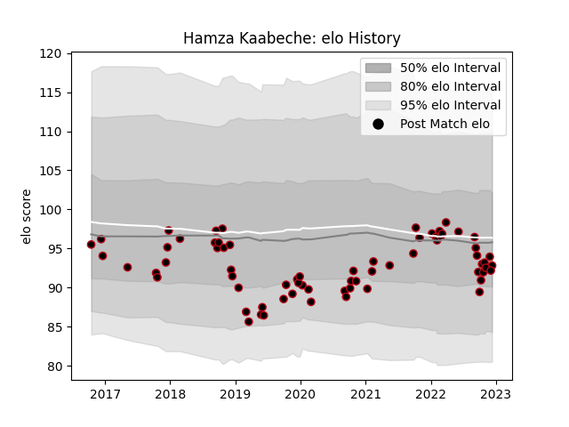

---  
layout: page  
title: Hamza Kaabeche  
date: 2023-02-02 19:09:43.789858  
categories: player  
---
# Hamza Kaabeche

## Positions: P

## Current elo: 85.0

## Current Percentile: 12.0

# Elo History

# Match History

| Team   |   Appearances |   Win Rate |
|:-------|--------------:|-----------:|
| Lyon   |            78 |   0.455128 |

| Opponent             |   Matches |   Win Rate |
|:---------------------|----------:|-----------:|
| Stade Toulousain     |         7 |   0.571429 |
| Bordeaux Begles      |         6 |   0.5      |
| Montpellier Herault  |         5 |   0.6      |
| Racing 92            |         5 |   0.2      |
| Castres Olympique    |         5 |   0.2      |
| Clermont Auvergne    |         5 |   0.2      |
| Pau                  |         5 |   0.9      |
| Brive                |         4 |   0.5      |
| Grenoble             |         4 |   0.75     |
| La Rochelle          |         3 |   0        |
| Stade Francais Paris |         3 |   1        |
| Saracens             |         3 |   0        |
| Perpignan            |         3 |   0.666667 |
| Newcastle Falcons    |         2 |   0.5      |
| Agen                 |         2 |   1        |
| Bayonne              |         2 |   0.5      |
| Glasgow Warriors     |         2 |   0        |
| Cardiff Blues        |         2 |   0        |
| Bulls                |         2 |   0.5      |
| Biarritz Olympique   |         2 |   1        |
| Toulon               |         2 |   0        |
| Leinster             |         1 |   0        |
| Northampton Saints   |         1 |   0        |
| Sale Sharks          |         1 |   1        |
| Benetton Treviso     |         1 |   0        |