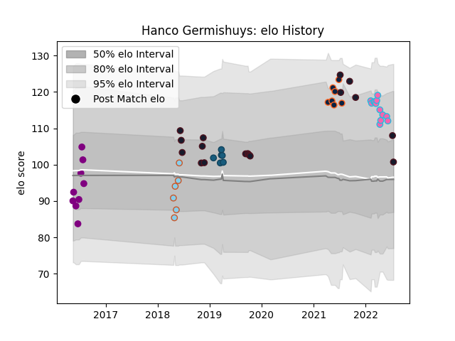

---  
layout: page  
title: Hanco Germishuys  
date: 2023-03-21 18:21:08.835722  
categories: player  
---
# Hanco Germishuys

Last updated: 2023-03-21
## Positions: FL, N8

## Country: United States of America

## Current elo: 101.0

## Current Percentile: 77.0

# Elo History

# Match History

| Team                     |   Appearances |   Win Rate |
|:-------------------------|--------------:|-----------:|
| United States of America |            18 |   0.444444 |
| L. A. Giltinis           |            13 |   0.692308 |
| R.U. New York            |            10 |   0.5      |
| Denver                   |             9 |   0.777778 |
| Rugby New York           |             7 |   0.714286 |
| Austin Elite Rugby       |             6 |   0.5      |
| Glendale Raptors         |             6 |   0.416667 |

| Opponent               |   Matches |   Win Rate |
|:-----------------------|----------:|-----------:|
| Utah Warriors          |         5 |   0.4      |
| Houston SaberCats      |         5 |   0.6      |
| San Diego Legion       |         5 |   0.7      |
| NOLA Gold              |         5 |   0.4      |
| Seattle Seawolves      |         4 |   0.5      |
| Rugby ATL              |         3 |   0.666667 |
| New England Free Jacks |         3 |   1        |
| Canada                 |         3 |   1        |
| Sacramento             |         3 |   1        |
| Ireland                |         2 |   0        |
| L. A. Giltinis         |         2 |   1        |
| Toronto Arrows         |         2 |   1        |
| San Diego              |         2 |   1        |
| England                |         2 |   0        |
| Ohio                   |         2 |   0        |
| Austin Gilgronis       |         2 |   0        |
| R.U. New York          |         2 |   0.5      |
| San Francisco          |         2 |   1        |
| Chile                  |         2 |   0.5      |
| Rugby New York         |         2 |   0.5      |
| Tonga                  |         1 |   0        |
| Scotland               |         1 |   1        |
| Argentina              |         1 |   0        |
| Samoa                  |         1 |   1        |
| Russia                 |         1 |   1        |
| Romania                |         1 |   1        |
| New Zealand Maori      |         1 |   0        |
| New Zealand            |         1 |   0        |
| Glendale Raptors       |         1 |   0        |
| France                 |         1 |   0        |
| Old Glory DC           |         1 |   1        |