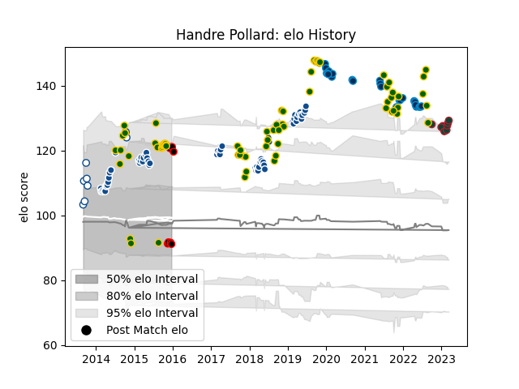

---  
layout: page  
title: Handre Pollard  
date: 2023-03-17 17:18:23.865660  
categories: player  
---
# Handre Pollard

## Positions: FH

## Country: South Africa

## Current elo: 91.0

## Current Percentile: 88.0

# Elo History

# Match History

| Team                            |   Appearances |   Win Rate |
|:--------------------------------|--------------:|-----------:|
| South Africa                    |            70 |   0.592857 |
| Bulls                           |            62 |   0.483871 |
| Montpellier Herault             |            27 |   0.462963 |
| Leicester Tigers                |             9 |   0.555556 |
| Blue Bulls                      |             8 |   0.375    |
| NTT Docomo Red Hurricanes Osaka |             7 |   0.214286 |

| Opponent                         |   Matches |   Win Rate |
|:---------------------------------|----------:|-----------:|
| New Zealand                      |        14 |   0.321429 |
| Argentina                        |        10 |   0.8      |
| Wales                            |         9 |   0.555556 |
| Stormers                         |         9 |   0.333333 |
| Australia                        |         9 |   0.333333 |
| Sharks                           |         8 |   0.875    |
| England                          |         6 |   0.5      |
| Lions                            |         5 |   0.8      |
| Scotland                         |         5 |   1        |
| Chiefs                           |         5 |   0.1      |
| Hurricanes                       |         4 |   0.25     |
| Cheetahs                         |         4 |   0.5      |
| Jaguares                         |         4 |   0.5      |
| Italy                            |         3 |   1        |
| Highlanders                      |         3 |   0.166667 |
| Melbourne Rebels                 |         3 |   1        |
| Pau                              |         3 |   0        |
| Racing 92                        |         3 |   0.333333 |
| Crusaders                        |         3 |   0.333333 |
| Clermont Auvergne                |         3 |   0.333333 |
| Brumbies                         |         3 |   0.333333 |
| British and Irish Lions          |         3 |   0.666667 |
| Blues                            |         3 |   0.333333 |
| Japan                            |         3 |   0.666667 |
| Queensland Reds                  |         2 |   0.5      |
| Saracens                         |         2 |   0.5      |
| New South Wales Waratahs         |         2 |   0.5      |
| Natal Sharks                     |         2 |   0        |
| Lyon                             |         2 |   0.5      |
| Sunwolves                        |         2 |   0.5      |
| Western Force                    |         2 |   0.5      |
| Western Province                 |         2 |   0        |
| La Rochelle                      |         2 |   0        |
| Castres Olympique                |         2 |   1        |
| Bayonne                          |         2 |   1        |
| Griquas                          |         2 |   1        |
| Ireland                          |         2 |   0        |
| Gloucester Rugby                 |         2 |   0.5      |
| France                           |         2 |   1        |
| Bordeaux Begles                  |         2 |   0.5      |
| Free State Cheetahs              |         2 |   0.5      |
| Brive                            |         1 |   1        |
| Shizuoka Blue Revs               |         1 |   0        |
| Stade Francais Paris             |         1 |   0.5      |
| Stade Toulousain                 |         1 |   0        |
| Leicester Tigers                 |         1 |   1        |
| Canada                           |         1 |   1        |
| Toyota Verblitz                  |         1 |   0        |
| United States of America         |         1 |   1        |
| Biarritz Olympique               |         1 |   1        |
| Bath Rugby                       |         1 |   1        |
| Toyota Industries Shuttles Aichi |         1 |   0        |
| Samoa                            |         1 |   1        |
| Coca-Cola Red Sparks             |         1 |   1        |
| Sale Sharks                      |         1 |   0        |
| Connacht                         |         1 |   1        |
| Perpignan                        |         1 |   1        |
| Ospreys                          |         1 |   0        |
| Northampton Saints               |         1 |   0        |
| Georgia                          |         1 |   1        |
| Green Rockets Tokatsu            |         1 |   0.5      |
| Mie Honda Heat                   |         1 |   0        |
| Harlequins                       |         1 |   0        |
| London Irish                     |         1 |   1        |
| Yokohama Canon Eagles            |         1 |   0        |