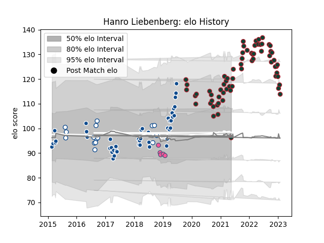

---  
layout: page  
title: Hanro Liebenberg  
date: 2023-02-02 19:14:16.902498  
categories: player  
---
# Hanro Liebenberg

## Positions: FL, N8

## Current elo: 96.0

## Current Percentile: 86.0

# Elo History

# Match History

| Team                 |   Appearances |   Win Rate |
|:---------------------|--------------:|-----------:|
| Leicester Tigers     |            66 |   0.613636 |
| Bulls                |            44 |   0.454545 |
| Blue Bulls           |            16 |   0.6875   |
| Stade Francais Paris |             5 |   0.2      |

| Opponent                 |   Matches |   Win Rate |
|:-------------------------|----------:|-----------:|
| Sale Sharks              |         8 |   0.125    |
| Worcester Warriors       |         6 |   0.833333 |
| Exeter Chiefs            |         6 |   0.333333 |
| Northampton Saints       |         6 |   0.666667 |
| Lions                    |         6 |   0.333333 |
| Harlequins               |         6 |   0.5      |
| Gloucester Rugby         |         6 |   1        |
| London Irish             |         5 |   0.8      |
| Newcastle Falcons        |         4 |   0.75     |
| Stormers                 |         4 |   0.5      |
| Wasps                    |         4 |   1        |
| Saracens                 |         4 |   0.5      |
| Jaguares                 |         4 |   0.5      |
| Hurricanes               |         4 |   0.25     |
| Bristol Rugby            |         3 |   0.5      |
| Queensland Reds          |         3 |   0.666667 |
| Bath Rugby               |         3 |   0.666667 |
| Sunwolves                |         3 |   0.333333 |
| Cheetahs                 |         3 |   0.666667 |
| Free State Cheetahs      |         3 |   0.666667 |
| Western Province         |         3 |   0.666667 |
| Sharks                   |         3 |   1        |
| Crusaders                |         2 |   0.5      |
| Toulon                   |         2 |   0        |
| Pumas                    |         2 |   1        |
| Ospreys                  |         2 |   0.5      |
| New South Wales Waratahs |         2 |   0.5      |
| Natal Sharks             |         2 |   0        |
| Brumbies                 |         2 |   0        |
| Chiefs                   |         2 |   0        |
| Golden Lions             |         2 |   0.5      |
| Griquas                  |         2 |   1        |
| Highlanders              |         2 |   0.25     |
| Blues                    |         2 |   0.25     |
| Boland Cavaliers         |         1 |   1        |
| La Rochelle              |         1 |   0        |
| Melbourne Rebels         |         1 |   1        |
| Stade Toulousain         |         1 |   0        |
| Brive                    |         1 |   1        |
| Perpignan                |         1 |   1        |
| Lyon                     |         1 |   0        |
| Western Force            |         1 |   1        |
| Eastern Province Kings   |         1 |   1        |
| Clermont Auvergne        |         1 |   1        |