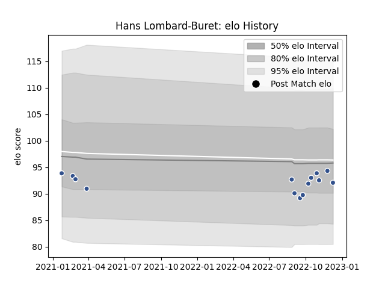

---  
layout: page  
title: Hans Lombard-Buret  
date: 2022-12-14 11:20:02.882838  
categories: player  
---
# Hans Lombard-Buret

## Positions: P

## Current elo: 92.0

## Current Percentile: 43.0

# Elo History

# Match History

| Team   |   Appearances |   Win Rate |
|:-------|--------------:|-----------:|
| Agen   |            14 |   0.357143 |

| Opponent            |   Matches |   Win Rate |
|:--------------------|----------:|-----------:|
| Aurillac            |         1 |          1 |
| Beziers             |         1 |          0 |
| Biarritz Olympique  |         1 |          1 |
| Brive               |         1 |          0 |
| Carcassonne         |         1 |          0 |
| Clermont Auvergne   |         1 |          0 |
| Colomiers           |         1 |          0 |
| Grenoble            |         1 |          0 |
| Montpellier Herault |         1 |          0 |
| Provence Rugby      |         1 |          1 |
| Rouen               |         1 |          1 |
| Soyaux-Angouleme    |         1 |          0 |
| Stade Toulousain    |         1 |          0 |
| Vannes              |         1 |          1 |