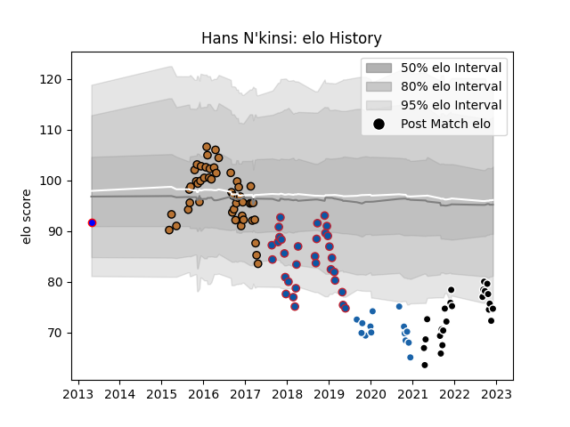

---  
layout: page  
title: Hans N'kinsi  
date: 2023-02-02 18:49:02.500967  
categories: player  
---
# Hans N'kinsi

## Positions: L

## Current elo: 61.0

## Current Percentile: 5.0

# Elo History

# Match History

| Team              |   Appearances |   Win Rate |
|:------------------|--------------:|-----------:|
| Narbonne          |            62 |   0.475806 |
| Grenoble          |            37 |   0.418919 |
| Provence Rugby    |            33 |   0.469697 |
| Castres Olympique |            16 |   0.3125   |
| Beziers           |             3 |   0.333333 |

| Opponent             |   Matches |   Win Rate |
|:---------------------|----------:|-----------:|
| Aurillac             |        10 |   0.4      |
| Carcassonne          |         9 |   0.666667 |
| Montauban            |         8 |   0.625    |
| Beziers              |         8 |   0.625    |
| Agen                 |         7 |   0.428571 |
| Perpignan            |         7 |   0.428571 |
| Dax                  |         7 |   0.857143 |
| Mont-de-Marsan       |         7 |   0.571429 |
| Colomiers            |         6 |   0.166667 |
| Biarritz Olympique   |         6 |   0.333333 |
| Nevers               |         5 |   0.4      |
| Oyonnax              |         4 |   0.25     |
| Vannes               |         4 |   0.5      |
| Soyaux-Angouleme     |         4 |   0.75     |
| Lyon                 |         4 |   0.25     |
| Albi                 |         4 |   0.25     |
| Bayonne              |         4 |   0.25     |
| Toulon               |         3 |   0        |
| Tarbes               |         3 |   0.333333 |
| Stade Toulousain     |         3 |   0        |
| Rouen                |         3 |   0.666667 |
| Racing 92            |         3 |   0.333333 |
| Bourgoin-Jallieu     |         3 |   0.833333 |
| Narbonne             |         3 |   0.5      |
| Montpellier Herault  |         3 |   0.666667 |
| Massy                |         3 |   0.333333 |
| La Rochelle          |         3 |   0        |
| Grenoble             |         3 |   0.833333 |
| Bordeaux Begles      |         2 |   0        |
| Pau                  |         2 |   0        |
| Clermont Auvergne    |         2 |   0        |
| Castres Olympique    |         2 |   0        |
| Ospreys              |         1 |   0        |
| Provence Rugby       |         1 |   1        |
| Benetton Treviso     |         1 |   0        |
| Stade Francais Paris |         1 |   1        |
| Dragons              |         1 |   0        |
| Worcester Warriors   |         1 |   1        |