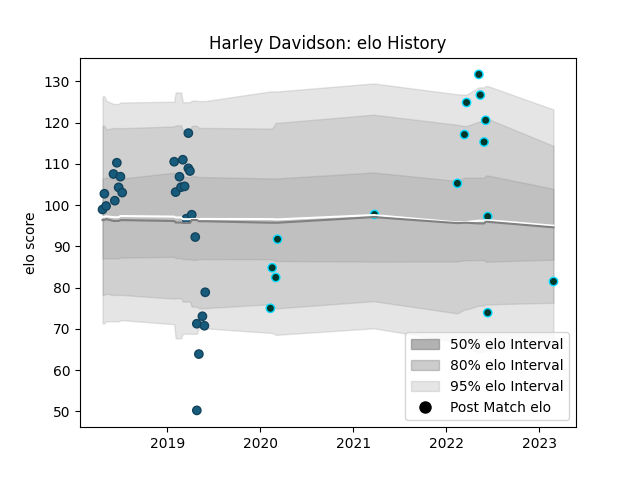

---  
layout: page  
title: Harley Davidson  
date: 2023-02-26 11:18:11.406172  
categories: player  
---
# Harley Davidson

## Positions: W

## Current elo: 82.0

## Current Percentile: 57.0

# Elo History

# Match History

| Team             |   Appearances |   Win Rate |
|:-----------------|--------------:|-----------:|
| Glendale Raptors |            27 |   0.592593 |
| Rugby ATL        |            15 |   0.533333 |

| Opponent               |   Matches |   Win Rate |
|:-----------------------|----------:|-----------:|
| NOLA Gold              |         6 |   0.833333 |
| Seattle Seawolves      |         6 |   0.333333 |
| Utah Warriors          |         6 |   0.75     |
| Toronto Arrows         |         5 |   0.6      |
| Austin Elite Rugby     |         3 |   1        |
| Houston SaberCats      |         3 |   0.666667 |
| R.U. New York          |         3 |   0.333333 |
| Rugby New York         |         3 |   0.333333 |
| San Diego Legion       |         3 |   0.166667 |
| Old Glory DC           |         2 |   0.5      |
| Austin Gilgronis       |         1 |   1        |
| New England Free Jacks |         1 |   0        |