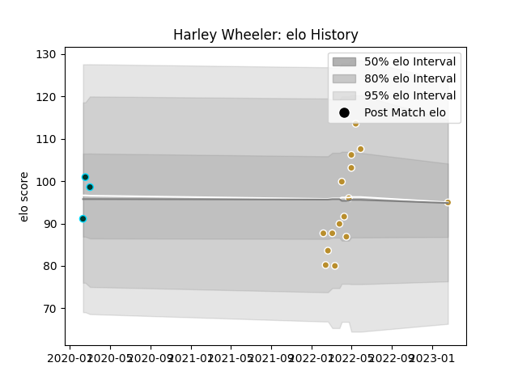

---  
layout: page  
title: Harley Wheeler  
date: 2023-02-24 02:33:01.974017  
categories: player  
---
# Harley Wheeler

## Positions: W

## Current elo: 95.0

## Current Percentile: 81.0

# Elo History

# Match History

| Team      |   Appearances |   Win Rate |
|:----------|--------------:|-----------:|
| NOLA Gold |            15 |   0.266667 |
| Rugby ATL |             3 |   0.666667 |

| Opponent               |   Matches |   Win Rate |
|:-----------------------|----------:|-----------:|
| New England Free Jacks |         4 |          0 |
| Toronto Arrows         |         3 |          0 |
| Old Glory DC           |         2 |          1 |
| Rugby ATL              |         2 |          0 |
| Austin Gilgronis       |         1 |          0 |
| Dallas Jackals         |         1 |          1 |
| NOLA Gold              |         1 |          1 |
| R.U. New York          |         1 |          0 |
| Rugby New York         |         1 |          0 |
| Seattle Seawolves      |         1 |          1 |
| Utah Warriors          |         1 |          1 |