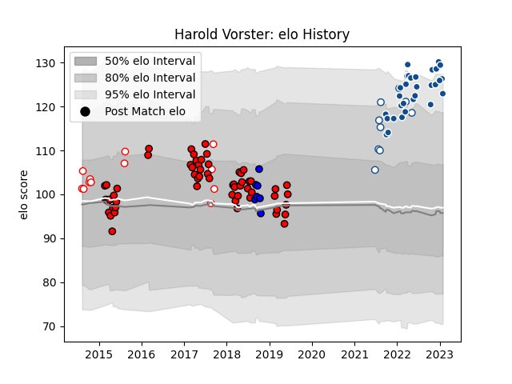

---  
layout: page  
title: Harold Vorster  
date: 2023-01-06 00:26:03.175699  
categories: player  
---
# Harold Vorster

## Positions: C

## Current elo: 127.0

## Current Percentile: 95.0

# Elo History

# Match History

| Team                 |   Appearances |   Win Rate |
|:---------------------|--------------:|-----------:|
| Lions                |            60 |   0.691667 |
| Bulls                |            27 |   0.592593 |
| Golden Lions         |            12 |   0.666667 |
| Blue Bulls           |             9 |   0.888889 |
| Saitama Wild Knights |             7 |   0.857143 |

| Opponent                          |   Matches |   Win Rate |
|:----------------------------------|----------:|-----------:|
| Sharks                            |        13 |   0.538462 |
| Stormers                          |        11 |   0.409091 |
| Bulls                             |         6 |   0.666667 |
| Jaguares                          |         6 |   0.833333 |
| Western Province                  |         5 |   0.4      |
| New South Wales Waratahs          |         5 |   1        |
| Crusaders                         |         4 |   0        |
| Cheetahs                          |         3 |   1        |
| Hurricanes                        |         3 |   0.333333 |
| Highlanders                       |         3 |   0.666667 |
| Natal Sharks                      |         3 |   0.666667 |
| Griquas                           |         3 |   1        |
| Sunwolves                         |         3 |   1        |
| Leinster                          |         2 |   0.5      |
| Lions                             |         2 |   1        |
| Melbourne Rebels                  |         2 |   1        |
| Southern Kings                    |         2 |   1        |
| Golden Lions                      |         2 |   1        |
| Free State Cheetahs               |         2 |   0.5      |
| Eastern Province Kings            |         2 |   1        |
| Ospreys                           |         2 |   1        |
| Pumas                             |         2 |   1        |
| Queensland Reds                   |         2 |   0.5      |
| Cardiff Blues                     |         2 |   1        |
| Brumbies                          |         2 |   0.5      |
| Blues                             |         2 |   0.5      |
| Blue Bulls                        |         2 |   1        |
| Munster                           |         2 |   0.5      |
| Benetton Treviso                  |         1 |   1        |
| Toshiba Brave Lupus Tokyo         |         1 |   1        |
| Ulster                            |         1 |   1        |
| Western Force                     |         1 |   1        |
| Yokohama Canon Eagles             |         1 |   1        |
| Shizuoka Blue Revs                |         1 |   1        |
| Kubota Spears Funabashi Tokyo-Bay |         1 |   1        |
| Scarlets                          |         1 |   1        |
| Mie Honda Heat                    |         1 |   1        |
| Black Rams Tokyo                  |         1 |   0        |
| Glasgow Warriors                  |         1 |   1        |
| Edinburgh                         |         1 |   0        |
| Dragons                           |         1 |   1        |
| Connacht                          |         1 |   0        |
| Coca-Cola Red Sparks              |         1 |   1        |
| Chiefs                            |         1 |   1        |
| Zebre                             |         1 |   1        |