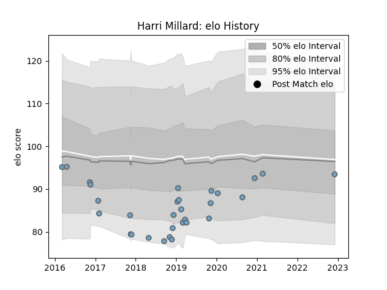

---  
layout: page  
title: Harri Millard  
date: 2022-12-12 15:04:50.300734  
categories: player  
---
# Harri Millard

## Positions: C, W

## Current elo: 93.0

## Current Percentile: None

# Elo History

# Match History

| Team          |   Appearances |   Win Rate |
|:--------------|--------------:|-----------:|
| Cardiff Blues |            30 |   0.333333 |

| Opponent           |   Matches |   Win Rate |
|:-------------------|----------:|-----------:|
| Glasgow Warriors   |         4 |   0        |
| Ospreys            |         3 |   0        |
| Connacht           |         3 |   0.666667 |
| Zebre              |         2 |   0.5      |
| Ulster             |         2 |   0        |
| Scarlets           |         2 |   0.5      |
| Newcastle Falcons  |         2 |   0.5      |
| Worcester Warriors |         1 |   0        |
| Southern Kings     |         1 |   1        |
| Saracens           |         1 |   0        |
| Sale Sharks        |         1 |   0        |
| Bulls              |         1 |   0        |
| Calvisano          |         1 |   1        |
| Lyon               |         1 |   1        |
| Leicester Tigers   |         1 |   0        |
| Exeter Chiefs      |         1 |   0        |
| Dragons            |         1 |   1        |
| Cheetahs           |         1 |   1        |
| Munster            |         1 |   0        |