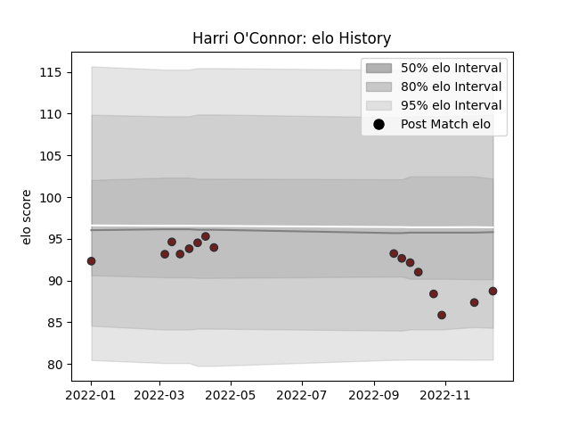

---  
layout: page  
title: Harri O'Connor  
date: 2023-01-30 11:42:03.184419  
categories: player  
---
# Harri O'Connor

## Positions: P

## Current elo: 79.0

## Current Percentile: 6.0

# Elo History

# Match History

| Team       |   Appearances |   Win Rate |
|:-----------|--------------:|-----------:|
| Scarlets   |            18 |   0.416667 |
| Nottingham |             9 |   0.222222 |

| Opponent            |   Matches |   Win Rate |
|:--------------------|----------:|-----------:|
| Cardiff Blues       |         3 |   0.666667 |
| Bulls               |         2 |   0.5      |
| Ospreys             |         2 |   0.75     |
| Ampthill            |         1 |   0        |
| Glasgow Warriors    |         1 |   1        |
| Ulster              |         1 |   0        |
| Stormers            |         1 |   0        |
| Sharks              |         1 |   0        |
| Saracens            |         1 |   0        |
| Richmond            |         1 |   1        |
| Leinster            |         1 |   0        |
| Hartpury College    |         1 |   0        |
| Dragons             |         1 |   0        |
| Ealing Trailfinders |         1 |   0        |
| Bayonne             |         1 |   1        |
| Doncaster           |         1 |   0        |
| Coventry            |         1 |   0        |
| Cornish Pirates     |         1 |   0        |
| Connacht            |         1 |   0        |
| Bordeaux Begles     |         1 |   0        |
| Benetton Treviso    |         1 |   0        |
| Bedford             |         1 |   1        |
| Zebre               |         1 |   1        |