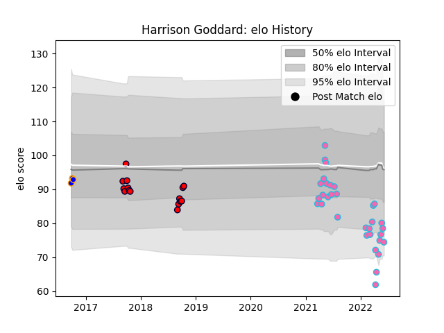

---  
layout: page  
title: Harrison Goddard  
date: 2023-02-24 09:47:37.287654  
categories: player  
---
# Harrison Goddard

## Positions: SH, FH

## Current elo: 74.0

## Current Percentile: 12.0

# Elo History

# Match History

| Team                |   Appearances |   Win Rate |
|:--------------------|--------------:|-----------:|
| L. A. Giltinis      |            32 |   0.78125  |
| Melbourne Rising    |            15 |   0.2      |
| Greater Sydney Rams |             3 |   0.666667 |

| Opponent               |   Matches |   Win Rate |
|:-----------------------|----------:|-----------:|
| Austin Gilgronis       |         4 |   0.75     |
| Houston SaberCats      |         4 |   0.75     |
| San Diego Legion       |         4 |   0.75     |
| Utah Warriors          |         3 |   1        |
| Seattle Seawolves      |         3 |   0.666667 |
| Queensland Country     |         3 |   0.333333 |
| Rugby ATL              |         3 |   0.666667 |
| NSW Country Eagles     |         3 |   0.333333 |
| Dallas Jackals         |         2 |   1        |
| Fijian Drua            |         2 |   0        |
| Canberra Vikings       |         2 |   0        |
| Toronto Arrows         |         2 |   1        |
| New England Free Jacks |         2 |   1        |
| Sydney Rays            |         2 |   0.5      |
| Brisbane City          |         2 |   0        |
| R.U. New York          |         2 |   0.5      |
| Rugby New York         |         2 |   0.5      |
| Perth Spirit           |         1 |   0        |
| Old Glory DC           |         1 |   1        |
| Melbourne Rising       |         1 |   1        |
| Greater Sydney Rams    |         1 |   1        |
| Western Force          |         1 |   0        |