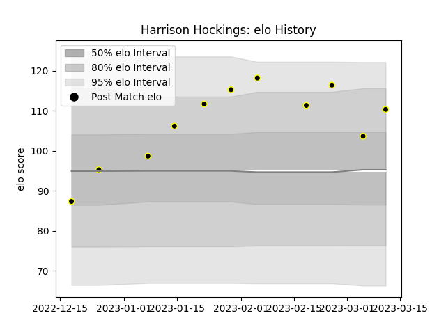

---  
layout: page  
title: Harrison Hockings  
date: 2023-03-21 18:21:54.678620  
categories: player  
---
# Harrison Hockings

Last updated: 2023-03-21
## Positions: L

## Current elo: 109.0

## Current Percentile: 79.0

# Elo History

# Match History

| Team             |   Appearances |   Win Rate |
|:-----------------|--------------:|-----------:|
| Tokyo Sungoliath |            11 |   0.818182 |

| Opponent                  |   Matches |   Win Rate |
|:--------------------------|----------:|-----------:|
| Hanazono Kintetsu Liners  |         2 |          1 |
| Black Rams Tokyo          |         1 |          1 |
| Green Rockets Tokatsu     |         1 |          1 |
| Kobelco Kobe Steelers     |         1 |          1 |
| Mitsubishi Dynaboars      |         1 |          1 |
| Saitama Wild Knights      |         1 |          0 |
| Shizuoka Blue Revs        |         1 |          1 |
| Toshiba Brave Lupus Tokyo |         1 |          1 |
| Toyota Verblitz           |         1 |          0 |
| Yokohama Canon Eagles     |         1 |          1 |