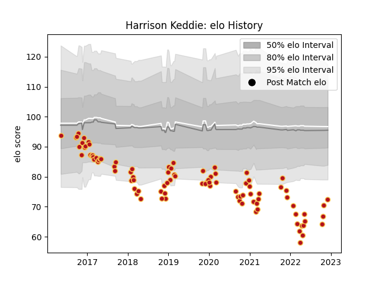

---  
layout: page  
title: Harrison Keddie  
date: 2022-12-09 13:04:38.493546  
categories: player  
---
# Harrison Keddie

## Positions: FL, N8

## Current elo: 72.0

## Current Percentile: 1.0

# Elo History

# Match History

| Team    |   Appearances |   Win Rate |
|:--------|--------------:|-----------:|
| Dragons |            93 |   0.247312 |

| Opponent           |   Matches |   Win Rate |
|:-------------------|----------:|-----------:|
| Edinburgh          |         8 |   0.25     |
| Scarlets           |         8 |   0.25     |
| Benetton Treviso   |         7 |   0.214286 |
| Glasgow Warriors   |         7 |   0.357143 |
| Zebre              |         7 |   0.285714 |
| Cardiff Blues      |         7 |   0        |
| Ulster             |         6 |   0        |
| Leinster           |         6 |   0        |
| Ospreys            |         6 |   0.666667 |
| Connacht           |         5 |   0.4      |
| Munster            |         4 |   0        |
| Worcester Warriors |         4 |   0.75     |
| RC Enisei          |         3 |   0.666667 |
| Brive              |         2 |   0.5      |
| Cheetahs           |         2 |   0.5      |
| Stormers           |         1 |   0        |
| Southern Kings     |         1 |   0        |
| Sharks             |         1 |   0        |
| Castres Olympique  |         1 |   0        |
| Saracens           |         1 |   0        |
| Newcastle Falcons  |         1 |   0        |
| Bristol Rugby      |         1 |   0        |
| Leicester Tigers   |         1 |   0        |
| Bulls              |         1 |   0        |
| Clermont Auvergne  |         1 |   0        |
| Northampton Saints |         1 |   0        |