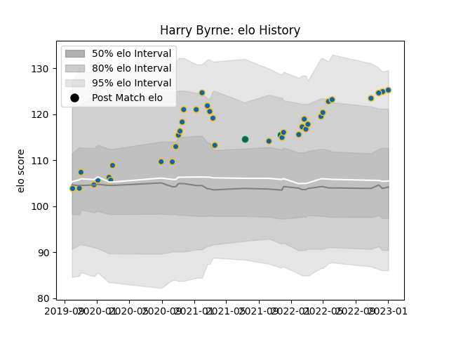

---  
layout: page  
title: Harry Byrne  
date: 2023-01-06 00:10:11.945289  
categories: player  
---
# Harry Byrne

## Positions: FH, C

## Country: Ireland

## Current elo: 125.0

## Current Percentile: 90.0

# Elo History

# Match History

| Team     |   Appearances |   Win Rate |
|:---------|--------------:|-----------:|
| Leinster |            37 |   0.864865 |
| Ireland  |             2 |   1        |

| Opponent                 |   Matches |   Win Rate |
|:-------------------------|----------:|-----------:|
| Glasgow Warriors         |         5 |       1    |
| Zebre                    |         4 |       1    |
| Ulster                   |         4 |       0.75 |
| Ospreys                  |         4 |       0.75 |
| Connacht                 |         3 |       1    |
| Benetton Treviso         |         3 |       1    |
| Cardiff Blues            |         2 |       0.5  |
| Dragons                  |         2 |       1    |
| Edinburgh                |         2 |       1    |
| Scarlets                 |         2 |       1    |
| Sharks                   |         1 |       0    |
| United States of America |         1 |       1    |
| Stormers                 |         1 |       0    |
| Argentina                |         1 |       1    |
| Racing 92                |         1 |       1    |
| Lions                    |         1 |       1    |
| Cheetahs                 |         1 |       1    |
| Munster                  |         1 |       1    |