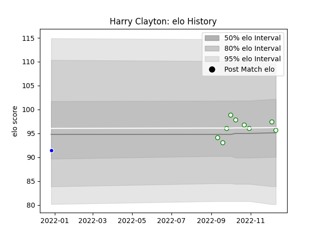

---  
layout: page  
title: Harry Clayton  
date: 2022-12-31 16:28:54.563798  
categories: player  
---
# Harry Clayton

## Positions: H

## Current elo: 95.0

## Current Percentile: 61.0

# Elo History

# Match History

| Team       |   Appearances |   Win Rate |
|:-----------|--------------:|-----------:|
| Nottingham |            10 |        0.4 |
| Coventry   |             1 |        1   |

| Opponent            |   Matches |   Win Rate |
|:--------------------|----------:|-----------:|
| Ampthill            |         1 |          1 |
| Bedford             |         1 |          0 |
| Caldy               |         1 |          1 |
| Cornish Pirates     |         1 |          0 |
| Coventry            |         1 |          0 |
| Doncaster           |         1 |          1 |
| Ealing Trailfinders |         1 |          0 |
| Hartpury College    |         1 |          0 |
| Jersey              |         1 |          0 |
| London Scottish     |         1 |          1 |
| Richmond            |         1 |          1 |