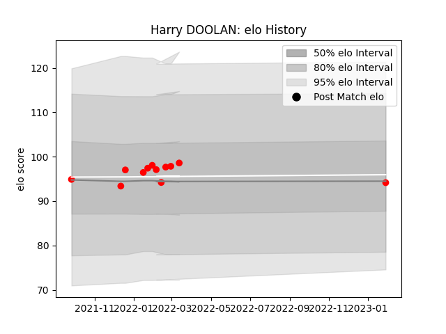

---  
layout: page  
title: Harry DOOLAN  
date: 2023-02-02 15:50:05.304556  
categories: player  
---
# Harry DOOLAN

## Positions: H

## Current elo: 95.0

## Current Percentile: 51.0

# Elo History

# Match History

| Team   |   Appearances |   Win Rate |
|:-------|--------------:|-----------:|
| Jersey |            12 |       0.75 |

| Opponent            |   Matches |   Win Rate |
|:--------------------|----------:|-----------:|
| Cornish Pirates     |         2 |        0.5 |
| Nottingham          |         2 |        1   |
| Ampthill            |         1 |        1   |
| Bedford             |         1 |        1   |
| Coventry            |         1 |        1   |
| Doncaster           |         1 |        0   |
| Ealing Trailfinders |         1 |        0   |
| Hartpury College    |         1 |        1   |
| London Scottish     |         1 |        1   |
| Richmond            |         1 |        1   |