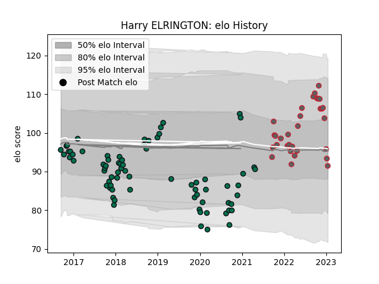

---  
layout: page  
title: Harry ELRINGTON  
date: 2023-02-05 17:55:21.681192  
categories: player  
---
# Harry ELRINGTON

## Positions: P

## Current elo: 91.0

## Current Percentile: 40.0

# Elo History

# Match History

| Team             |   Appearances |   Win Rate |
|:-----------------|--------------:|-----------:|
| London Irish     |            75 |   0.506667 |
| Gloucester Rugby |            33 |   0.469697 |

| Opponent               |   Matches |   Win Rate |
|:-----------------------|----------:|-----------:|
| Wasps                  |         7 |   0.428571 |
| Northampton Saints     |         7 |   0.428571 |
| Harlequins             |         6 |   0.25     |
| Worcester Warriors     |         6 |   0.333333 |
| Sale Sharks            |         6 |   0.166667 |
| Exeter Chiefs          |         6 |   0.333333 |
| Leicester Tigers       |         5 |   0.2      |
| Bristol Rugby          |         5 |   0.5      |
| Saracens               |         5 |   0.2      |
| Bath Rugby             |         5 |   0.2      |
| Gloucester Rugby       |         5 |   0.2      |
| London Irish           |         4 |   0.875    |
| Newcastle Falcons      |         3 |   0.333333 |
| Richmond               |         3 |   1        |
| Nottingham             |         2 |   1        |
| Stade Francais Paris   |         2 |   0.5      |
| Leinster               |         2 |   0        |
| Yorkshire Carnegie     |         2 |   1        |
| Krasny Yar Krasnoyarsk |         2 |   1        |
| Cornish Pirates        |         2 |   1        |
| Jersey                 |         2 |   1        |
| Bayonne                |         2 |   0.5      |
| Bedford                |         2 |   1        |
| Edinburgh              |         2 |   0        |
| Ealing Trailfinders    |         2 |   1        |
| Krasny Yar             |         2 |   1        |
| Toulon                 |         1 |   0        |
| Cardiff Blues          |         1 |   1        |
| Scarlets               |         1 |   0        |
| Dragons                |         1 |   1        |
| Coventry               |         1 |   1        |
| Rotherham Titans       |         1 |   1        |
| Pau                    |         1 |   1        |
| Hartpury College       |         1 |   1        |
| London Welsh           |         1 |   1        |
| London Scottish        |         1 |   1        |
| Agen                   |         1 |   1        |