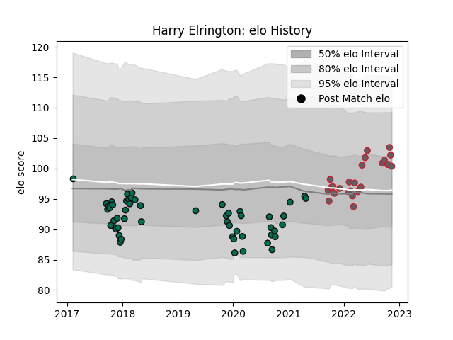

---  
layout: page  
title: Harry Elrington  
date: 2022-11-22 11:33:07.633966  
categories: player  
---
# Harry Elrington

## Positions: P

## Current elo: 102.0

## Current Percentile: 79.0

# Elo History

# Match History

| Team             |   Appearances |   Win Rate |
|:-----------------|--------------:|-----------:|
| London Irish     |            53 |   0.301887 |
| Gloucester Rugby |            25 |   0.5      |

| Opponent             |   Matches |   Win Rate |
|:---------------------|----------:|-----------:|
| Wasps                |         7 |   0.428571 |
| Worcester Warriors   |         6 |   0.333333 |
| Sale Sharks          |         6 |   0.166667 |
| Northampton Saints   |         6 |   0.333333 |
| Gloucester Rugby     |         5 |   0.2      |
| Leicester Tigers     |         5 |   0.2      |
| Harlequins           |         5 |   0.3      |
| Bath Rugby           |         5 |   0.2      |
| Exeter Chiefs        |         5 |   0.4      |
| Bristol Rugby        |         5 |   0.5      |
| Saracens             |         4 |   0.25     |
| Newcastle Falcons    |         3 |   0.333333 |
| London Irish         |         3 |   0.833333 |
| Krasny Yar           |         2 |   1        |
| Edinburgh            |         2 |   0        |
| Bayonne              |         2 |   0.5      |
| Stade Francais Paris |         2 |   0.5      |
| Ealing Trailfinders  |         1 |   1        |
| Nottingham           |         1 |   1        |
| Cardiff Blues        |         1 |   1        |
| Scarlets             |         1 |   0        |
| Toulon               |         1 |   0        |