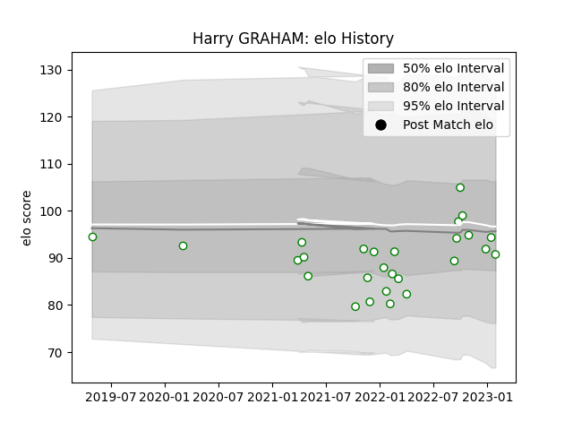

---  
layout: page  
title: Harry GRAHAM  
date: 2023-02-05 15:16:13.753783  
categories: player  
---
# Harry GRAHAM

## Positions: W

## Current elo: 91.0

## Current Percentile: 38.0

# Elo History

# Match History

| Team       |   Appearances |   Win Rate |
|:-----------|--------------:|-----------:|
| Nottingham |            27 |   0.222222 |

| Opponent            |   Matches |   Win Rate |
|:--------------------|----------:|-----------:|
| Cornish Pirates     |         5 |       0    |
| Coventry            |         4 |       0.25 |
| Doncaster           |         4 |       0.25 |
| Ealing Trailfinders |         3 |       0    |
| London Scottish     |         3 |       1    |
| Bedford             |         2 |       0    |
| Hartpury College    |         2 |       0    |
| Caldy               |         1 |       1    |
| Jersey              |         1 |       0    |
| Richmond            |         1 |       0    |
| Saracens            |         1 |       0    |