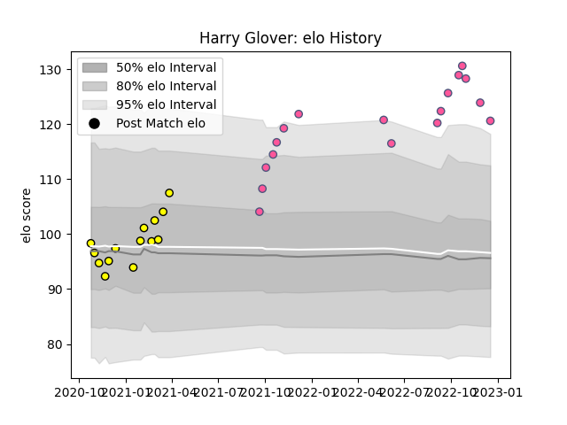

---  
layout: page  
title: Harry Glover  
date: 2023-01-23 15:30:20.853037  
categories: player  
---
# Harry Glover

## Positions: W, C

## Current elo: 117.0

## Current Percentile: 89.0

# Elo History

# Match History

| Team                 |   Appearances |   Win Rate |
|:---------------------|--------------:|-----------:|
| Stade Francais Paris |            18 |   0.388889 |
| Carcassonne          |            14 |   0.607143 |

| Opponent            |   Matches |   Win Rate |
|:--------------------|----------:|-----------:|
| Brive               |         3 |   0.333333 |
| Vannes              |         2 |   0.25     |
| Nevers              |         2 |   0.5      |
| Toulon              |         2 |   0        |
| Castres Olympique   |         2 |   0.5      |
| Colomiers           |         2 |   0.5      |
| La Rochelle         |         2 |   0.5      |
| Lyon                |         2 |   0.5      |
| Montpellier Herault |         2 |   0        |
| Soyaux-Angouleme    |         1 |   1        |
| Rouen               |         1 |   1        |
| Provence Rugby      |         1 |   0        |
| Perpignan           |         1 |   1        |
| Pau                 |         1 |   1        |
| Aurillac            |         1 |   1        |
| Montauban           |         1 |   1        |
| Benetton Treviso    |         1 |   0        |
| Lions               |         1 |   0        |
| Grenoble            |         1 |   1        |
| Clermont Auvergne   |         1 |   1        |
| Biarritz Olympique  |         1 |   1        |
| Mont-de-Marsan      |         1 |   0        |