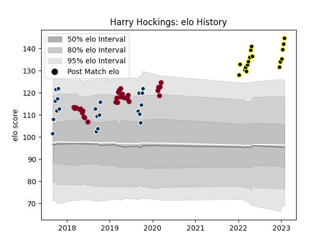

---  
layout: page  
title: Harry Hockings  
date: 2022-12-28 12:57:51.527713  
categories: player  
---
# Harry Hockings

## Positions: L

## Current elo: 120.0

## Current Percentile: 93.0

# Elo History

# Match History

| Team               |   Appearances |   Win Rate |
|:-------------------|--------------:|-----------:|
| Queensland Reds    |            29 |   0.413793 |
| Queensland Country |            21 |   0.666667 |
| Tokyo Sungoliath   |            13 |   0.769231 |

| Opponent                          |   Matches |   Win Rate |
|:----------------------------------|----------:|-----------:|
| Sunwolves                         |         4 |   0.75     |
| Melbourne Rising                  |         3 |   0.666667 |
| Brumbies                          |         3 |   0.666667 |
| Bulls                             |         3 |   0.666667 |
| Canberra Vikings                  |         3 |   0.666667 |
| Fijian Drua                       |         3 |   0.666667 |
| NSW Country Eagles                |         3 |   1        |
| Sydney Rays                       |         3 |   0.666667 |
| Jaguares                          |         3 |   0.333333 |
| Toshiba Brave Lupus Tokyo         |         2 |   0.5      |
| Blues                             |         2 |   0.5      |
| Kubota Spears Funabashi Tokyo-Bay |         2 |   0.5      |
| Highlanders                       |         2 |   0        |
| Sharks                            |         2 |   0.5      |
| Stormers                          |         2 |   0.5      |
| Crusaders                         |         2 |   0        |
| Western Force                     |         2 |   0        |
| Brisbane City                     |         2 |   1        |
| New South Wales Waratahs          |         2 |   0        |
| Black Rams Tokyo                  |         1 |   1        |
| Toyota Verblitz                   |         1 |   1        |
| Urayasu D-Rocks                   |         1 |   1        |
| Shizuoka Blue Revs                |         1 |   1        |
| Melbourne Rebels                  |         1 |   0        |
| Saitama Wild Knights              |         1 |   0        |
| Perth Spirit                      |         1 |   0        |
| NTT Docomo Red Hurricanes Osaka   |         1 |   1        |
| Lions                             |         1 |   1        |
| Kobelco Kobe Steelers             |         1 |   1        |
| Hurricanes                        |         1 |   0        |
| Green Rockets Tokatsu             |         1 |   1        |
| Greater Sydney Rams               |         1 |   1        |
| Chiefs                            |         1 |   0        |
| Yokohama Canon Eagles             |         1 |   1        |