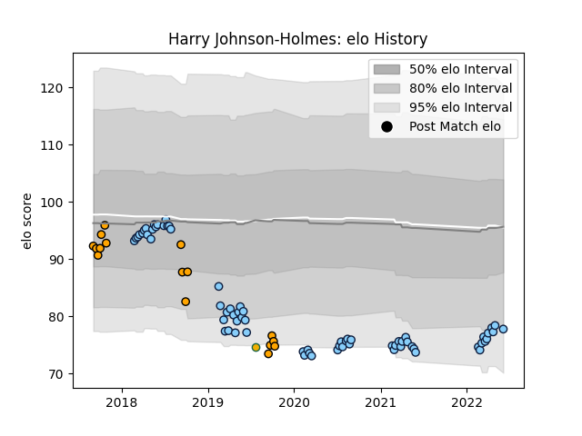

---  
layout: page  
title: Harry Johnson-Holmes  
date: 2023-03-21 18:38:16.477600  
categories: player  
---
# Harry Johnson-Holmes

Last updated: 2023-03-21
## Positions: P

## Country: Australia

## Current elo: 78.0

## Current Percentile: 8.0

# Elo History

# Match History

| Team                     |   Appearances |   Win Rate |
|:-------------------------|--------------:|-----------:|
| New South Wales Waratahs |            71 |   0.387324 |
| NSW Country Eagles       |            16 |   0.3125   |
| Australia                |             1 |   0        |

| Opponent            |   Matches |   Win Rate |
|:--------------------|----------:|-----------:|
| Melbourne Rebels    |        11 |   0.545455 |
| Brumbies            |        10 |   0.1      |
| Queensland Reds     |        10 |   0.5      |
| Western Force       |         8 |   0.625    |
| Fijian Drua         |         5 |   0.5      |
| Sunwolves           |         4 |   0.75     |
| Lions               |         4 |   0.25     |
| Blues               |         4 |   0        |
| Crusaders           |         4 |   0.5      |
| Chiefs              |         4 |   0        |
| Highlanders         |         3 |   0.666667 |
| Hurricanes          |         3 |   0        |
| Brisbane City       |         3 |   0.166667 |
| Melbourne Rising    |         2 |   0.5      |
| Queensland Country  |         2 |   0        |
| Canberra Vikings    |         2 |   0.5      |
| Sharks              |         2 |   0.25     |
| Jaguares            |         2 |   0        |
| Greater Sydney Rams |         1 |   0        |
| South Africa        |         1 |   0        |
| Stormers            |         1 |   1        |
| Bulls               |         1 |   0        |
| Sydney Rays         |         1 |   1        |