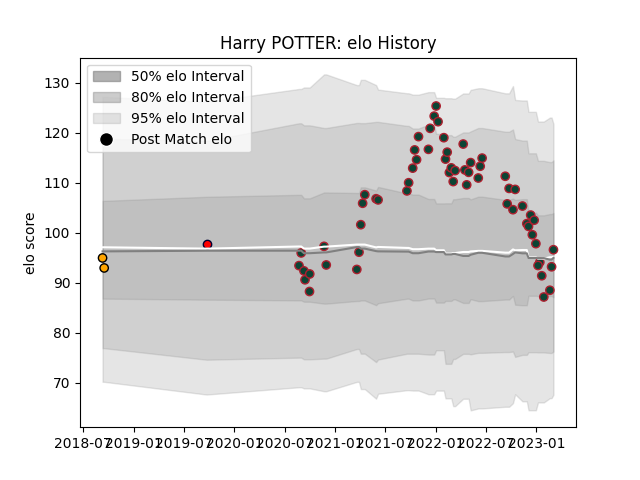

---  
layout: page  
title: Harry POTTER  
date: 2023-03-06 11:27:00.328340  
categories: player  
---
# Harry POTTER

## Positions: W

## Current elo: 97.0

## Current Percentile: 45.0

# Elo History

# Match History

| Team               |   Appearances |   Win Rate |
|:-------------------|--------------:|-----------:|
| Leicester Tigers   |            60 |   0.641667 |
| NSW Country Eagles |             2 |   0        |
| Melbourne Rising   |             1 |   1        |

| Opponent           |   Matches |   Win Rate |
|:-------------------|----------:|-----------:|
| Northampton Saints |         6 |   0.833333 |
| Bath Rugby         |         5 |   0.4      |
| Newcastle Falcons  |         5 |   0.8      |
| Bristol Rugby      |         5 |   0.5      |
| Gloucester Rugby   |         5 |   0.8      |
| London Irish       |         5 |   0.8      |
| Clermont Auvergne  |         4 |   1        |
| Sale Sharks        |         4 |   0.25     |
| Wasps              |         3 |   0.333333 |
| Saracens           |         3 |   0.666667 |
| Worcester Warriors |         3 |   1        |
| Harlequins         |         3 |   0.666667 |
| Exeter Chiefs      |         3 |   0.333333 |
| Ospreys            |         2 |   0.5      |
| Bordeaux Begles    |         1 |   1        |
| Leinster           |         1 |   0        |
| Queensland Country |         1 |   1        |
| Toulon             |         1 |   0        |
| Connacht           |         1 |   1        |
| Western Force      |         1 |   0        |
| Melbourne Rising   |         1 |   0        |