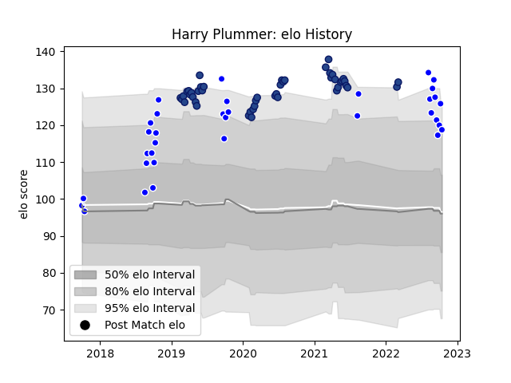

---  
layout: page  
title: Harry Plummer  
date: 2023-03-30 11:35:04.430490  
categories: player  
---
# Harry Plummer

Last updated: 2023-03-30
## Positions: FH, C

## Current elo: 119.0

## Current Percentile: 93.0

# Elo History

# Match History

| Team     |   Appearances |   Win Rate |
|:---------|--------------:|-----------:|
| Blues    |            46 |   0.576087 |
| Auckland |            34 |   0.647059 |

| Opponent                 |   Matches |   Win Rate |
|:-------------------------|----------:|-----------:|
| Chiefs                   |         8 |   0.625    |
| Hurricanes               |         8 |   0.5      |
| Highlanders              |         7 |   0.714286 |
| Crusaders                |         6 |   0        |
| Tasman                   |         6 |   0.333333 |
| Canterbury               |         5 |   0.6      |
| Wellington               |         4 |   0.5      |
| North Harbour            |         3 |   1        |
| Taranaki                 |         3 |   1        |
| New South Wales Waratahs |         3 |   1        |
| Southland                |         3 |   1        |
| Otago                    |         2 |   0.5      |
| Waikato                  |         2 |   0.5      |
| Stormers                 |         2 |   1        |
| Queensland Reds          |         2 |   0.5      |
| Bay of Plenty            |         2 |   0.5      |
| Northland                |         2 |   0.5      |
| Brumbies                 |         2 |   0.5      |
| Counties Manukau         |         2 |   1        |
| Bulls                    |         2 |   0.75     |
| Sharks                   |         1 |   0        |
| Melbourne Rebels         |         1 |   1        |
| Sunwolves                |         1 |   1        |
| Lions                    |         1 |   1        |
| Jaguares                 |         1 |   0        |
| Western Force            |         1 |   1        |