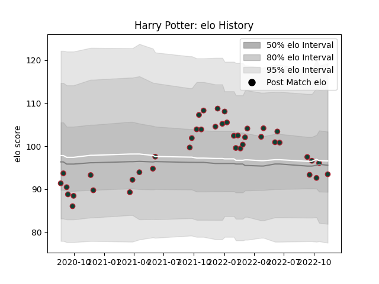

---  
layout: page  
title: Harry Potter  
date: 2022-11-16 11:40:28.900250  
categories: player  
---
# Harry Potter

## Positions: W

## Current elo: 93.0

## Current Percentile: 51.0

# Elo History

# Match History

| Team             |   Appearances |   Win Rate |
|:-----------------|--------------:|-----------:|
| Leicester Tigers |            42 |   0.619048 |

| Opponent           |   Matches |   Win Rate |
|:-------------------|----------:|-----------:|
| Northampton Saints |         5 |   1        |
| Bath Rugby         |         4 |   0.25     |
| Bristol Rugby      |         4 |   0.5      |
| Gloucester Rugby   |         4 |   0.75     |
| Exeter Chiefs      |         3 |   0.333333 |
| Harlequins         |         3 |   0.666667 |
| London Irish       |         3 |   0.666667 |
| Newcastle Falcons  |         3 |   1        |
| Sale Sharks        |         3 |   0.333333 |
| Wasps              |         3 |   0.333333 |
| Worcester Warriors |         3 |   1        |
| Saracens           |         2 |   0.5      |
| Bordeaux Begles    |         1 |   1        |
| Toulon             |         1 |   0        |